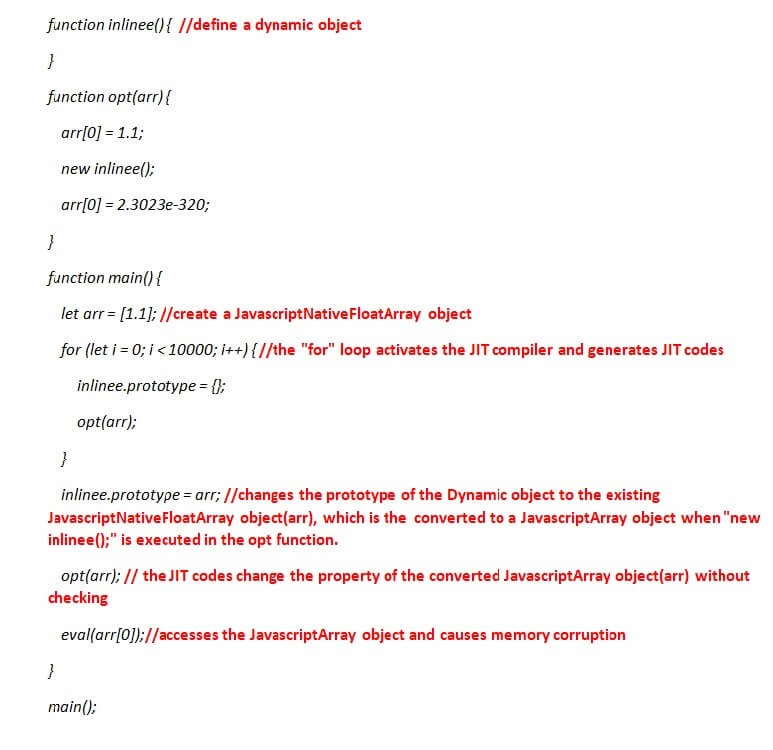
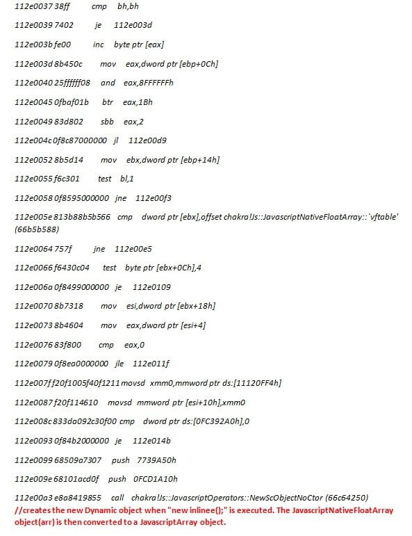
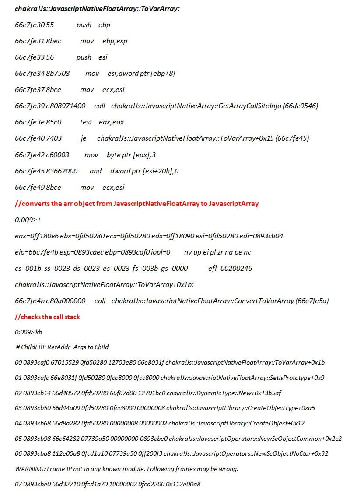
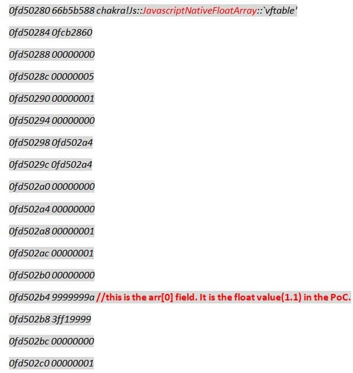
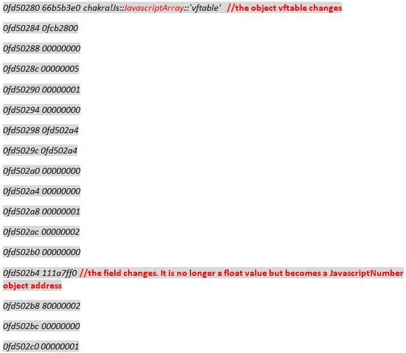
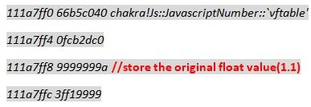
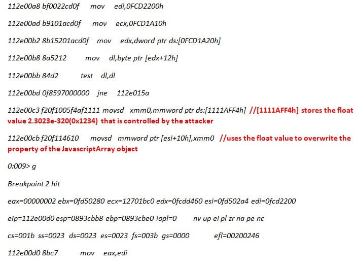
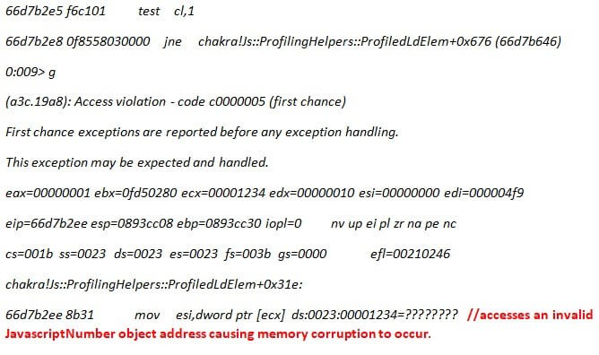

> 译文声明
> 本文是翻译文章，文章原作者 Dehui Yin，文章来源：https://www.fortinet.com 
> 
> 原文地址：https://www.fortinet.com/blog/threat-research/an-analysis-of-microsoft-edge-chakra-new-scobjectnoctor-array-type-confusion.html
> 
> 译文仅供参考，具体内容表达以及含义原文为准

CVE-2018-0838是Microsoft边查克拉引擎“式的困惑”的错误这是一个固定三个月前微软。此漏洞会导致内存损坏，并且可能会在易受攻击的系统通过Microsoft Edge浏览恶意网页时被利用来执行任意代码。

当由Chakra即时（JIT）java编译器生成的代码在未经验证的情况下更改新转换的JavascriptArray对象的属性值时，会发生此类混淆错误。在这篇文章中，FortiGuard实验室的团队深入研究了Microsoft Edge Chakra Engine汇编代码，以揭示此漏洞的根本原因。

Chakra即时（JIT）java编译器为Javascript函数生成机器代码，这些代码被多次调用以获得更好的性能。在正常情况下，Chakra在设置对象属性之前检查值类型以避免类型混淆错误; 但是，由Chakra即时（JIT）java编译器生成的机器码不会执行检查并直接设置属性值，这会导致在稍后访问该属性时内存损坏。 

我们使用了以下PoC，这是基于Google安全研究团队在我们分析过程中发布的信息。

以下所有汇编代码均取自chakra.dll 11.00.14393.447版。我的补充评论已被突出显示。

由JIT编译器生成的opt（）函数代码的一部分：

看着NewScObjectNoCtor，我们可以很容易地发现JavascriptNativeFloatArray :: ConvertToVarArray被调用来将JavascriptNativeFloatArray对象（arr）转换成一个JavascriptArray对象。 

对象arr的内存地址是0xfd50280。你可以观察下面的内存变化。

之前：

之后：

让我们来检查内存中的JavascriptNumber对象0x111a7ff0：

调用NewScObjectNoCtor函数后，Chakra返回到opt（）函数代码：

接下来，让我们检查地址为0xfd50280的对象arr中的内存更改：

后者访问arr [0]会导致内存损坏：

Fortinet发布了IPS签名MS.Edge.Chakra.NewScObjectNoCtor.Array.Type.Confusion来解决此漏洞。

