##  1 概观
欢迎来到Windows漏洞利用开发系列文章的第1部分。在第一部分中，我将介绍一些为了更好的理解未来文章内容所需的基础知识，包括一些汇编语法，Windows内存布局以及调试器的使用。当然这里并不会面面俱到，所以如果你没有接触过汇编，或者在阅读完第一篇文章后有什么不清楚的地方，希望你能看看我提供的各种资源链接。

本系列接下来的文章写作计划是从简单的（直接EIP覆盖）到更复杂的（unicode，ASLR绕过，堆喷，设备驱动程序漏洞利用等）的各种攻击主题，使用实际漏洞攻击作为列子。我没有什么更具体的计划，所以当我想到更多主题时，我会继续写帖子。 
## 2 目的
本系列文章是查找和利用Windows应用程序漏洞，希望那些没有太多技术知识的安全和IT专业人员会对软件安全感兴趣并将其技能使私人和公共领域的软件更安全。免责声明：如果你是一个想要参与非法或不道德行为的人，你可以不用看了。

这些帖子并不打算与[Corelan Team](https://www.corelan.be/index.php/2009/07/19/exploit-writing-tutorial-part-1-stack-based-overflows/)，[The Gray Corner](http://www.thegreycorner.com/)和 [Fuzzy Security](http://www.fuzzysecurity.com/tutorials.html)等其他优秀教程进行竞争。相反，本系列文章是为了补充它们，并为解释和例子提供另一个资源 。我极力鼓励你去看看这些伟大的教程。
## 3 你需要什么
如果您想要更好的理解本系列教程，您需要做以下准备：
安装Windows：我计划从Windows XP SP3开始，但随着进展和覆盖不同的主题/漏洞，我还可能使用其他版本，包括Windows 7和Windows Server 2003/2008。
调试器：在Windows上，您还需要一个调试器。我将主要使用 Immunity Debugger ，您可以在这里[下载](http://debugger.immunityinc.com/ID_register.py)  。你也应该安装[mona](https://github.com/corelan/mona)插件。我还会使用[WinDbg](https://docs.microsoft.com/en-us/windows-hardware/drivers/debugger/index)进行调试。
Backtrack / Kali主机（可选）：我的所有脚本使用Kali，在我使用的任何远程攻击示例中将其用作“攻击机器”。我计划在大多数脚本中使用Perl和Python，您可以选择在Windows上安装任何一种语言环境。
## 4 Immunity Debugger入门
让我们先看一下调试器，因为在整个教程中我们将花费相当多的时间调试。我将主要使用Immunity调试器，因为它是免费的，并且具有一些插件和自定义脚本功能。  

我将使用Windows Media Player作为示例程序来介绍Immunity Debugger。打开Windows Media Player和免疫调试器。在Immunity中，单击File - > Attach并选择应用程序/进程的名称（在我的示例中为wmplayer）。注意：您也可以直接从Immunity启动WMP，方法是单击文件 - >打开并选择可执行文件。
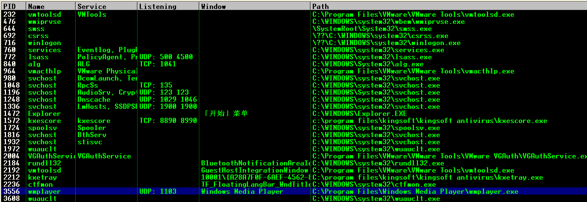
一旦你启动了一个可执行程序或者连接到Immunity中的一个进程，你应该进入CPU视图（如果没有，按Alt + C），像这样：
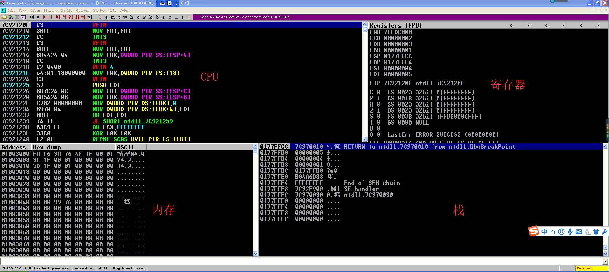
当您运行/附加到具有免疫功能的程序时，它会以暂停状态启动（请参阅右下角）。要运行该程序，您可以按F9（或工具栏中的播放按钮）。要进入下一条指令（但暂停程序执行），请按F7。您可以使用F7逐步执行每条指令。如果在任何时候想要重新启动程序，请按Ctrl + F2。本教程将不会提供关于如何使用Immunity的完整教程，但是会提及任何相关的快捷方式和热键。  
如您所见，CPU窗口被分成四个窗格，描述以下信息：

    CPU指令:显示内存地址，操作码和汇编指令，附加注释，功能名称以及与CPU指令相关的其他信息
    寄存器:显示与应用程序当前状态相关的通用寄存器，指令指针和标志的内容
    堆栈:显示当前堆栈的内容
    内存转储:显示应用程序内存的内容

让我们从寄存器开始更深入地看看每一个。 
### 4.1 寄存器
CPU寄存器作为用于快速访问数据的小型存储区域。在x86（32位）架构中，有8个通用寄存器：EAX，EBX，ECX，EDX，EDI，ESI，EBP和ESP。他们可以在技术上用于存储任何数据，尽管它们最初是为了执行特定任务而设计的，而且在很多情况下，仍然可以用于存储任何数据。
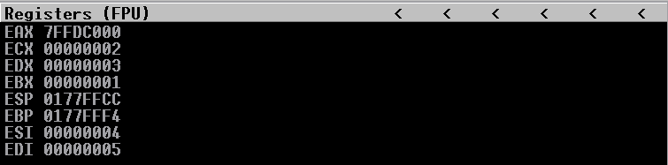
#### EAX - 累加器寄存器
它被称为累加器寄存器，因为它是用于常用计算的主寄存器（如ADD和SUB）。虽然其他寄存器可用于计算，但EAX通过分配更高效的单字节操作码而享有优先权。当涉及到编写有限的可用缓冲区空间的shellcode时，这种效率可能很重要（更多内容将在未来的教程中介绍！）。除了用于计算之外，EAX还用于存储函数的返回值。 

这个通用寄存器可以全部或部分地被引用，如下所示：EAX是指整个32位寄存器。AX指最低有效16位，可以进一步分解为AH（AX的8个最高有效位）和AL（8个最低有效位）。
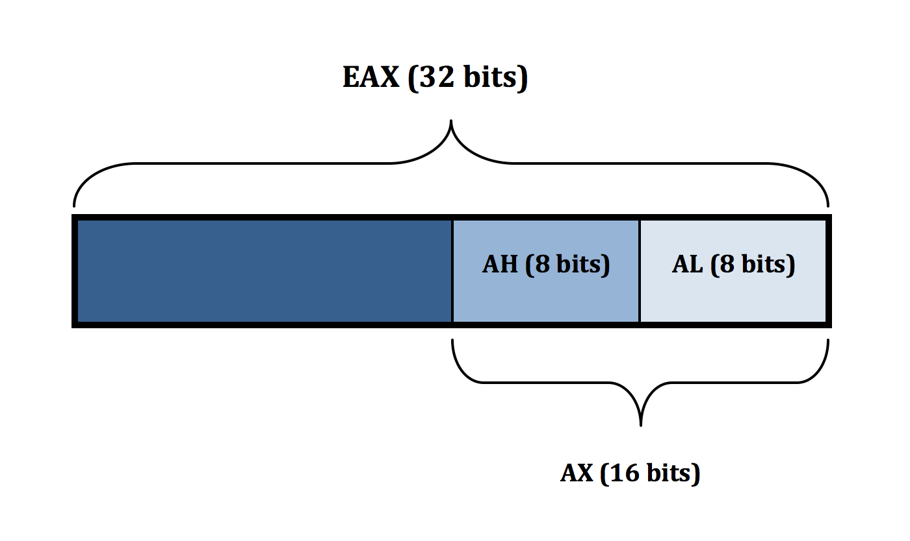
也适用于接下来的三个寄存器（EBX，ECX和EDX）
#### EBX - 基础寄存器

在32位体系结构中，EBX并没有真正的特殊用途，所以只要把它看作是可用的存储寄存器。像EAX一样，它可以被整体引用（EBX）或部分引用（BX，BH，BL）。
#### ECX - 计数寄存器 

顾名思义，计数器（或计数）寄存器通常用作循环和函数重复计数器，但它也可用于存储任何数据。像EAX一样，它可以在整个（ECX）或部分（CX，CH，CL）中被引用。
#### EDX - 数据寄存器

EDX有点像EAX的伙伴。它经常用于除法和乘法等数学运算，以处理溢出，余数存储在EDX中，计算结果被EAX存储。它也常用于存储函数变量。像EAX一样，它可以在整个（EDX）或部分（DX，DH，DL）中被引用
#### ESI - 源寄存器

EDI，ESI的通常用于存储指向读取位置的指针。例如，如果一个函数被设计为读取一个字符串，ESI保存该字符串的地址。
#### EDI - 目的寄存器

虽然EDI可以（并且）用于通用数据存储，但EDI主要用于存储函数的存储指针，例如字符串操作的写入地址。
#### EBP - 基本指针

EBP用于跟踪堆栈的底部。它通常用于使用EBP当前值的偏移量来引用位于堆栈上的变量，但如果参数仅由寄存器引用，则可以选择将EBP用于一般用途。 
#### ESP - 堆栈指针

ESP用于跟踪堆栈的顶部。随着项目被移入和移出ESP，ESP相应地增加/减少。在所有通用寄存器中，ESP很少/从不用于除预定目的之外的任何其他用途。 
#### 指令指针（EIP）

不是通用寄存器，EIP指向CPU要执行的下一条指令的存储器地址。正如您将在接下来的教程中看到的那样，控制EIP您就可以控制应用程序的执行流程（以执行您选择的代码）。 
#### 段寄存器和EFLAGS寄存器

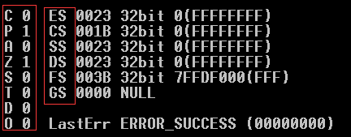

您将在寄存器窗格看到一些额外的寄存器。我将不会详细介绍，但请注意，EFLAGS寄存器由一系列标志组成，这些标志表示由计算和比较产生的布尔值，并且可用于确定何时/是否采取有条件的跳转（稍后详细介绍）。 

有关CPU寄存器的更多信息，请查看以下资源：

- http://wiki.skullsecurity.org/Registers 
- http://www.swansontec.com/sregisters.html 

### 4.2 内存
跳到CPU视图的“内存”窗格，这就是您可以查看内存位置内容的简单方法。例如，假设您想查看ESP中的内存内容，该内容在以下屏幕截图中指向0007D47C。右键单击ESP，选择“按照转储”，并且“内存”窗格将显示该位置。

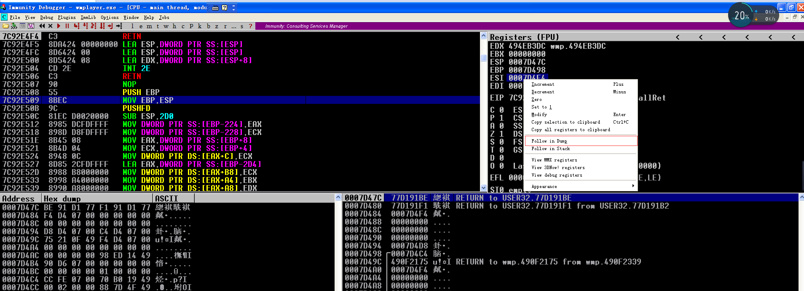

### 4.3 CPU
正如您知道的那样，今天的大多数应用程序都是用高级语言（C，C ++等）编写的。编译应用程序时，这些高级语言指令被翻译成具有相应操作码的汇编语言，以帮助将指令进一步转换为机器可以理解的内容（机器代码）。在调试器中，您可以查看CPU指令窗格中CPU正在处理的每个汇编指令（和相应的操作码）。注意：对于Windows漏洞利用系列，将使用x86汇编语言[Intel语法](http://en.wikipedia.org/wiki/X86_assembly_language#Syntax)。

您可以逐个执行程序的执行流程（F7）并查看每条CPU指令的结果。我们来看看当前Windows Media Player的一条简单的汇编指令：

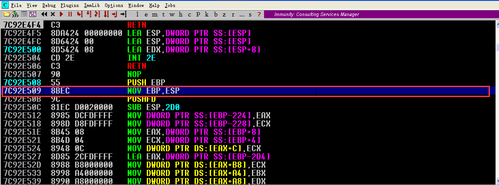

这条指令的功能就是把寄存器ESP中的值赋给EBP

这只是一个简单的例子，您可以在Immunity中关注每条CPU指令的执行情况。以下有几个更常见的汇编指令和语法你会遇到：
    
    ADD / SUB op1，op2 - 加或减两个操作数，将结果存储在第一个操作数中。这些可以是寄存器，内存位置（限制一个）或常量。例如，ADD EAX，10表示将EAX的值加10并将结果存储在EAX中
    
    XOR EAX，EAX - 将寄存器值设为零; 一个清除寄存器内容的简单方法
    
    INC / DEC op1-将操作数的值递增或递减1
    
    CMP op1，op2 - 比较两个操作数（寄存器/内存地址/常量）的值并设置相应的EFLAGS值。
    
    跳转（JMP）和条件跳转（je，jz等） - 顾名思义，这些指令允许您跳转到执行流程/指令集中的另一个位置。JMP指令只是跳转到某个位置，而条件跳转（je，jz等）仅在符合某些条件时才使用（使用前面提到的EFLAGS寄存器值）。例如，您可以比较两个寄存器的值，并在两者相等的情况下跳转到某个位置（使用je指令和零标志（zf）= 1）。  
    
    当您看到诸如ADD DWORD PTR [X]或MOV eax的值时，[ebx]它指的是存储在内存地址 X 处的值。换句话说，EBX指的是EBX的内容，而[EBX]指的是到存储在EBX内存地址的值。 

    相关关键字：BYTE = 1个字节，WORD = 2个字节，DWORD = 4个字节。 

我当然不是专家，但是当谈到理解并最终开发自己的漏洞利用代码时，你应该对Assembly有一个很好的把握。随着我们的进展，我将讨论更多的汇编指令，但我不打算深入讨论汇编语言，因此，如果您需要进行复习，那么会有大量良好的在线资源，
包括：

- [x86汇编指南](http://www.cs.virginia.edu/~evans/cs216/guides/x86.html)
- [Sandpile.org](http://www.sandpile.org/)
- [汇编语言编程的艺术](https://courses.engr.illinois.edu/ece390/books/artofasm/artofasm.html)
- [Windows汇编语言](http://www.securitytube.net/groups?operation=viewall&groupId=0)

如果你想买本书，你可以考虑[Hacking: The Art of Exploitation](https://www.amazon.com/Hacking-The-Art-Exploitation-ebook/dp/B004OEJN3I)，不仅涵盖了Assembly的基础知识，而且还涉及漏洞利用（主要在Linux环境中）。 

对于本系列文章，我将尽我所能解释我使用的任何代码示例，所以如果您对Assembly有一些基本的了解，理解起来应该没问题。 
## 5 Windows内存布局
在我们谈论堆栈之前，我想简要地谈谈Win32进程内存布局。预先说明，只是大概介绍，不会涵盖诸如地址空间布局随机化（ASLR），虚拟地址到物理地址的转换，内存分页，物理地址扩展等概念。我打算在以后的部分文章中说这些内容，但现在我想让事情变得非常简单。  

首先，在Windows Media Player附带Immunity后，按ALT + M查看内存映射（也可以选择View-> Memory或单击工具栏上的'M'图标）。

您应该看到如下所示的内容（确切条目可能有所不同）：

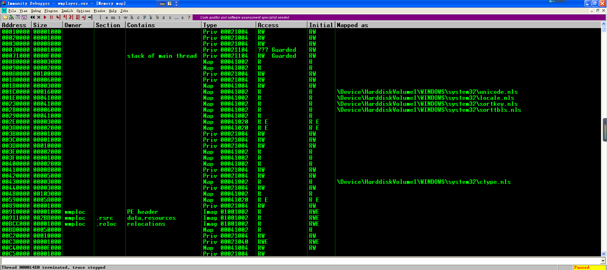

这是wmplayer.exe的内存布局，包括堆栈，堆，加载的模块（DLL）和可执行文件本身。我将使用在Corelan 关于基于堆栈溢出（Stack Based Overflows）的绝佳入门教程(已失效）中找到的内存映射的一个稍微简化的版本，详细介绍每个这些条目，具体条目已对应到Windows Media Player的Immunity内存映射。 

让我们从底部开始介绍，从内存部分从0xFFFFFFFF到0x7FFFFFFF部分，这通常被称为“Kernel Land”。 
### Kernel Land
这部分内存由操作系统保留用于设备驱动程序，系统缓存，分页/非分页池，HAL等。没用户访问这部分内存。注意：有关Windows内存管理的详细说明，您应该查看Windows Internals书籍（目前有两册）。

### PEB和TEB(s)
运行程序/应用程序时，会运行称为进程的可执行文件实例 。每个进程提供运行该程序实例所需的资源。每个Windows进程都有一个执行进程（EPROCESS）结构，其中包含进程属性和指向相关数据结构的指针。尽管这些EPROCESS结构中的大多数都驻留在Kernel Land中，但进程环境块（PEB）驻留在用户可访问的内存中。PEB包含有关正在运行的进程的各种用户模式参数。您可以使用WinDbg通过发出！peb命令轻松检查PEB的内容。  

如您所见，PEB包含可执行文件的基地址，堆的位置，加载的模块（DLL）以及环境变量（操作系统，相关路径等）等信息。看看上面的WinDbg截图中的ImageBaseAddress。请注意地址01000000.现在回到之前的Win32内存映射图，并注意这与“Program Image”块的第一个地址是如何相同的。您可以对堆地址和关联的DLL执行相同的操作。  

关于符号文件的快速注释...在调试Windows应用程序时加载适当的符号文件特别有用，因为它们为函数，变量等提供了有用的描述性信息。您可以在WinDbg中导航到“文件 - >符号文件路径...”。按照这里找到的说明：http://support.microsoft.com/kb/311503。您也可以通过“调试 - >调试符号选项”来在Immunity中加载符号文件。 

关于整个PEB结构的更多细节可以在[这里](https://msdn.microsoft.com/en-us/library/windows/desktop/aa813706%28v=vs.85%29.aspx?f=255&MSPPError=-2147217396)找到。

程序或进程可以有一个或多个线程，作为操作系统分配处理器时间的基本单元。每个进程都从一个线程（主线程）开始，但可以根据需要创建其他线程。所有线程共享分配给父进程的相同虚拟地址空间和系统资源。每个线程也有自己的资源，包括异常处理程序，优先级，本地存储等。就像每个程序/进程都有一个PEB一样，每个线程都有一个线程环境块（TEB）。TEB存储image loader和各种Windows DLL的上下文信息，以及异常处理程序列表的位置（我们将在后面的文章中详细介绍）。和PEB一样，TEB驻留在进程地址空间中，因为用户模式组件需要可写访问。  

您还可以使用WinDbg查看TEB(s)。

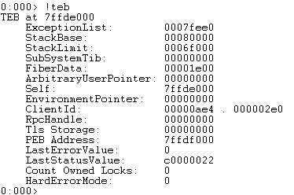

关于整个TEB结构的 更多细节可以在[这里](https://msdn.microsoft.com/en-us/library/windows/desktop/ms686708(v=vs.85).aspx)找到，关于进程和线程的更多细节可以在[这里](https://msdn.microsoft.com/en-us/library/windows/desktop/ms681917(v=vs.85).aspx)找到。

### DLLs
Windows程序利用称为动态链接库（DLL）的共享代码库，可以实现高效的代码重用和内存分配。这些DLL（也称为模块或可执行模块）占用了部分内存空间。如Memory Map截图所示，您可以在Memory视图（Alt + M）的Immunity中查看它们，或者如果只想查看DLL，可以选择Executable Module视图（Alt + E）。有OS /系统模块（ntdll，user32等）以及特定于应用程序的模块，后者通常可用于产生溢出漏洞（以后发布的文章会说明）。  

下面是Immunity中Memory视图的截图：

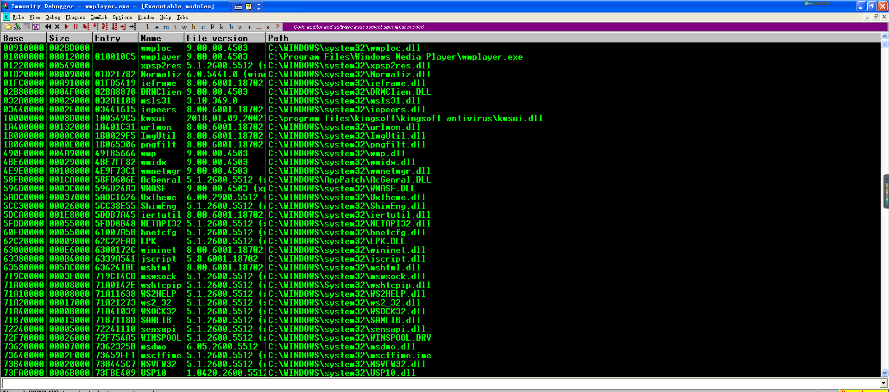

### Program Image
内存的Program Image部分是可执行文件所在的位置。这包括.text部分（包含可执行代码/ CPU指令）.data部分（包含程序的全局数据）和.rsrc部分（包含非可执行资源，包括图标，图像和字符串）。
### Heap
堆是程序用来存储内存的动态分配（例如malloc（））部分。与栈不同，堆内存分配必须由应用程序管理。换句话说，该内存将保持分配状态，直到程序释放或程序本身终止。您可以将堆视为共享的内存池，而接下来将介绍的堆栈更加有组织。

### Stack
不同于堆，全局变量的内存分配是相对任意且持久的，栈以有序的方式为本地（函数/方法）变量分配短期存储。回想一下给定的进程可以有多个线程。每个线程/函数都分配了自己的栈帧。该栈帧的大小在创建后固定，并且在该函数结束时删除栈帧。

### PUSH和POP

在我们看一个函数如何分配一个Stack Frames之前，让我们快速看看一些简单的PUSH和POP指令，这样你就可以看到数据如何被放入栈并从栈中取出。该堆栈是后进先出（LIFO）结构，这意味着您放入栈的最后一个数据是您下一次能使用的第一个数据。您将物品“推”到堆叠顶部，然后从堆叠顶部“弹出”物品。我们来看看这个行动...

在以下屏幕截图中，您将在CPU指令窗格（左上角）中看到一系列PUSH指令，每个指令都将从其中一个寄存器（右上方窗格）获取值，并将该值放在栈顶部（右下窗格）。 

我们从第一个PUSH指令开始（PUSH ECX）。
 
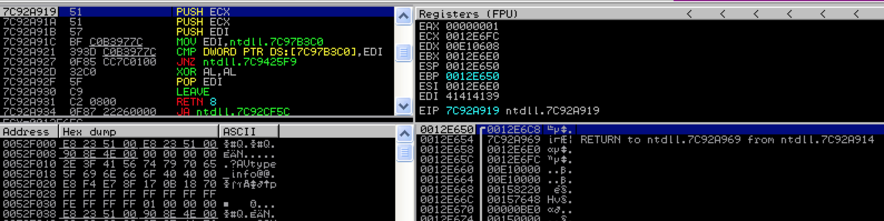

记下ECX的值以及栈顶部的地址和值（前一个屏幕截图的右下角）。现在执行PUSH ECX指令...

在第一个PUSH ECX指令之后，来自ECX（地址0012E6FC）的值被推送到栈顶（如上图所示）。注意栈顶部的地址如何减少4个字节（从0012E650到0012E64C）。这说明随着数据被推送到栈，栈如何向上增长以降低地址。另请注意，ESP指向栈顶部，EBP指向此Stack Frames的底部。您会注意到在下面的截图中，EBP（基指针）保持不变，而ESP（栈指针）随着栈的增长和收缩而变化。现在，第二个PUSH ECX指令将被执行......

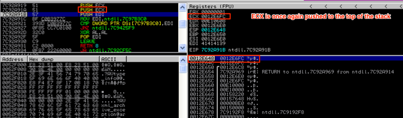

再一次，ECX（0012E6FC）的值被推到栈顶，ESP将其值再调整4个字节，正如你在上面的屏幕截图中看到的那样，最后的PUSH指令（PUSH EDI）即将执行。 

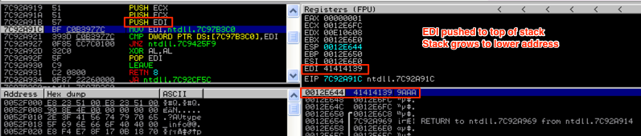

现在，来自EDI（41414139）的值被推到栈顶，列表中的下一条指令即将被执行（一条MOV指令），并且EDI的值被改变。让我们跳到POP EDI指令来显示如何从栈中取出数据。在这种情况下，栈顶部的当前值（41414139）将被弹出并放入EDI中。 

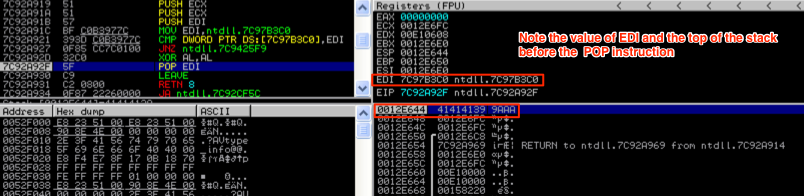

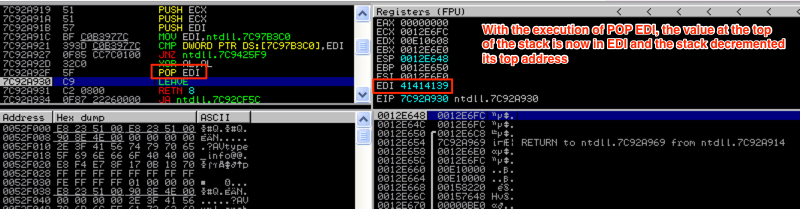

如您所见，EDI的值已经根据POP指令变回41414139。现在您已了解如何操纵栈，接下来我们来看看如何为函数创建Stack Frames以及如何将局部变量放置在栈上。当我们在本系列的第2部分中讨论基于堆栈的溢出时，理解这一点至关重要。 
### Stack Frames and Functions
当一个程序函数执行时，会创建一个Stack Frames来存储它的局部变量。每个函数都有自己的Stack Frames，它放在当前栈的顶部，并导致栈向上扩展到较低的地址。 

每次创建Stack Frames时，都执行一系列指令来存储函数参数和返回地址（以便程序知道函数结束后该去哪里），保存当前Stack Frames的基指针，并为本地函数变量开辟空间。[注：我故意省略这个基本讨论的SEH，但将在以后的帖子中解决它们]。 

让我们来看看使用我能找到的最简单的函数（来自[维基百科](https://en.wikipedia.org/wiki/Stack_buffer_overflow)）来创建Stack Frames：

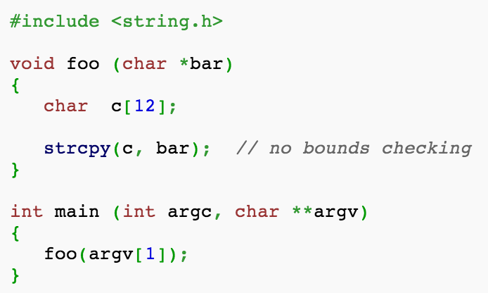

这段代码简单地调用函数foo（），并传递给它一个命令行参数作为参数（argv [1]）。函数foo（）先声明一个长度为12的变量c。然后它调用函数strcpy（），它将argv [1]的值复制到变量c中。正如注释所述，没有边界检查，所以这种使用strcpy可能会导致缓冲区溢出，我将在本系列的第2部分中演示这些缓冲区溢出。现在，我们只关注这个函数如何影响栈。  

我使用Visual Studio命令提示符（2010）编译了这个c程序（作为stack_demo.exe）。你可以直接从Immunity运行一个带有命令行参数的程序，方法是选择File-> Open（或者简单地按F3），选择你的可执行文件，然后在给定的字段中输入你的命令行参数。

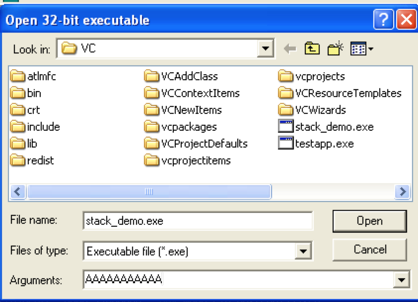

对于这个例子，我简单地使用了11个A作为argv [1]。[我们会看看在第2部分中使用超过11的情况会发生什么！]

如果你想动态调试，你可能会想要在代码的相关部分插入一些断点。由于地址可能发生变化，查找我们相关程序代码的最佳方法是选择查看 - >可执行模块（或Alt + E）。然后，双击stack_demo.exe模块（或任何您命名为.exe的文件）。

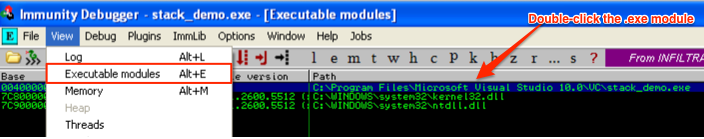

转到以下内容：

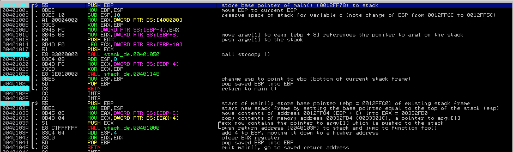

你看到的第一行实际上是foo（）的开始，但我们首先要看看main（）。我已经设置了几个断点来帮助您浏览代码（由淡蓝色突出显示），您可以通过选择所需的地址并按F2来执行相同的操作。让我们来看看main（）...

尽管main（）除了调用函数foo（）之外，还有一些工作必须首先发生，就像在调试器中看到的那样。首先，它将Argv [1]（A​​AAAAAAAAAAAA）的内容推送到栈。然后，当函数foo（）被调用时，返回地址被保存到栈中，保证程序执行流程可以在函数foo（）终止后恢复。  

看看我已经注释过的Immunity屏幕截图 - 只需要注意现在红色框中的内容; 在函数foo（）被调用之前，你会看到一个指向argv [1]的指针被推入栈。然后执行CALL指令，并将下一条指令（EIP + 4）的返回地址也推送到栈。

如果您想要证明地址00332FD4包含0033301C（这是指向argv [1]的指针），请参阅该地址的转储内容：

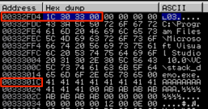

您会看到向后写入的内容为1C303300。让我借此机会快速介绍Little Endian。“字节顺序”是指字节存储在内存中的顺序。基于Intel x86的系统使用Little Endian，它在最小的存储器地址处存储值的最低有效字节（这就是为什么地址以相反顺序存储的原因）。作为一个例子，参考上面的十六进制转储屏幕截图 - 顶部地址（00332FD4）最小，底部地址（00333034）最大。因此，左上角的字节（当前由1C占据）占据最小的地址位置，并且地址会从左到右和从上到下移动时变大。当您查看诸如0033301C之类的地址时，最低有效字节是一直到右边的字节（1C）。要将其转换为Little Endian，您需要重新排序它，每次一个字节，从右到左。下面是一个示意图：

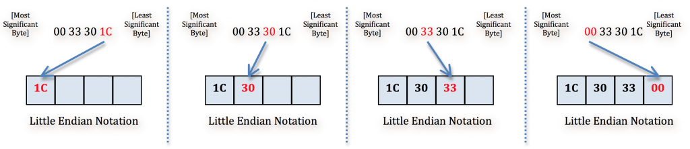

好的，argv [1]和返回地址现在已经被推送到堆栈，并调用函数foo（）。如下图。

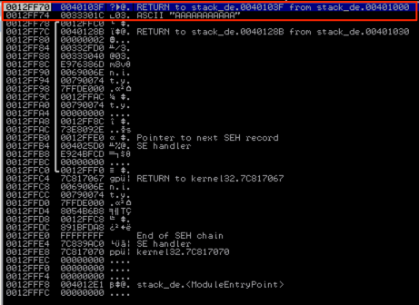

请地址0012FF74处指向argv [1]的指针，并在其上方存储RETURN值。如果回顾main（）的前一个截图，您会注意到0040103F的RETURN地址是CALL foo（）之后的下一条指令，这是foo（）结束后程序执行的地方。  

现在让我们看看函数foo（）：

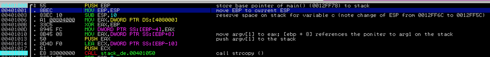

一旦函数foo（）被调用，首先发生的事情是当前基指针（EBP）通过PUSH EBP指令保存到堆栈，这样一旦函数终止，main（）堆栈的基础就可以恢复。 

接下来，将EBP设置为等于ESP（通过指令MOV EBP，ESP），使堆栈帧的顶部和底部相等。从这里开始，EBP将保持不变（在函数foo的生命周期中），随着数据被添加到函数的栈帧，ESP将会长到更低的地址。这是寄存器的前后视图，显示EBP现在等于ESP。

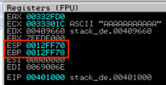

接下来，通过以下指令为局部变量c（char c [12]）开辟空间：SUB ESP，10。 

以下是这一系列指令后的栈：

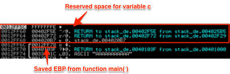

请注意栈的顶部（作为ESP的结果）如何从0012FF6C更改为0012FF5C。  

让我们跳到strcpy（）的调用，它会将argv [1]（A​​AAAAAAAAAAAA）的内容复制到刚刚保留在变量c上的空间中。这里看看调试器中的指令。我只突出显示了执行写入栈的部分。

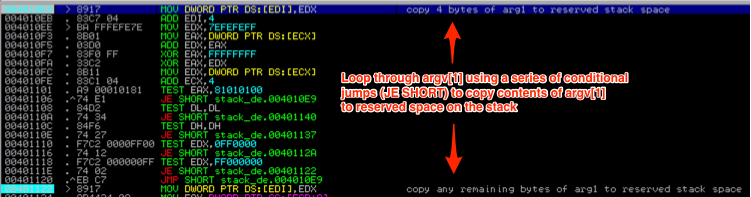

在下面的屏幕截图中，您会注意到它会继续遍历argv [1]的值，写入栈中（从c缓冲区的起始地址往下），直到写入完所有的argv [1]到栈。

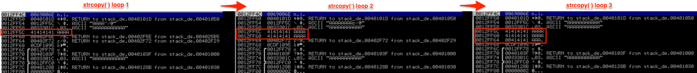

在我们看看函数终止时栈会是什么情况之前，先看看下面的步骤图，以强化函数foo（）被调用时所采取的步骤。

在strcpy（）完成并且函数foo（）准备终止之后，必须在栈上进行一些清理。让我们来看一下栈，当foo（）准备终止并且程序执行被转回到main（）。

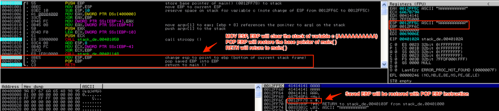

如您所见，执行的第一条指令是MOV ESP，EBP，它将EBP的值放入ESP中，因此它现在指向0012FF6C，并从栈中删除变量c（AAAAAAAAAAA）。栈顶部现在包含已保存的EBP：

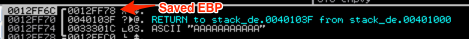

当执行下一条指令POP EBP时，它将从main（）中恢复先前的堆栈基址指针，并将ESP增加4倍。堆栈指针现在指向调用foo（）之前放在堆栈上的RETURN值。当执行RETN指令时，它将使程序执行流程返回到紧接在CALL foo（）指令之后的main（）中的下一条指令，如下面的屏幕截图所示。

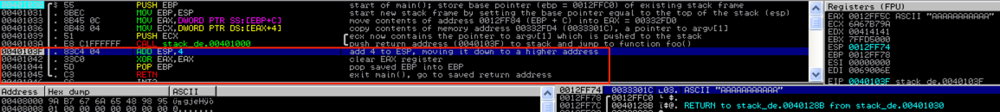

函数main（）将通过将栈指针向下移动（通过将其值增加4）并清除argv [1]。然后它将通过XOR存储argv [1]（EAX）的寄存器，恢复保存的EBP并返回到保存的返回地址。  

这个列子足够了解一个函数 stack frame是如何创建/删除以及本地变量如何存储在堆栈上的。如果你想要更多的例子，我鼓励你查看一些其他很棒的教程（尤其是那些由Corelan Team发布的教程，已失效）。

## 6 结论
这是Windows Exploits系列的第一部分的结尾。希望您熟悉使用调试器，可以识别一些基本的汇编指令，并且了解（高层次）Windows如何管理内存以及堆栈如何操作。在下一篇文章中，我们将使用相同的基本函数foo（）来引入基于栈溢出的概念。然后，我将立刻写一个针对实际软件产品的真实示例漏洞利用。  