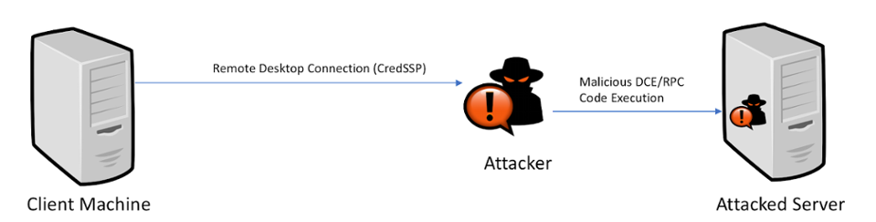
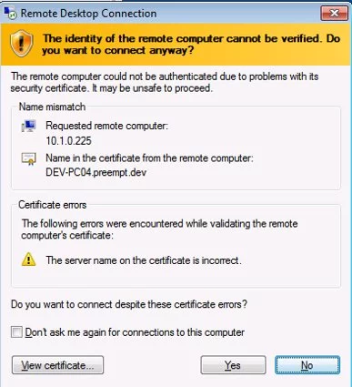
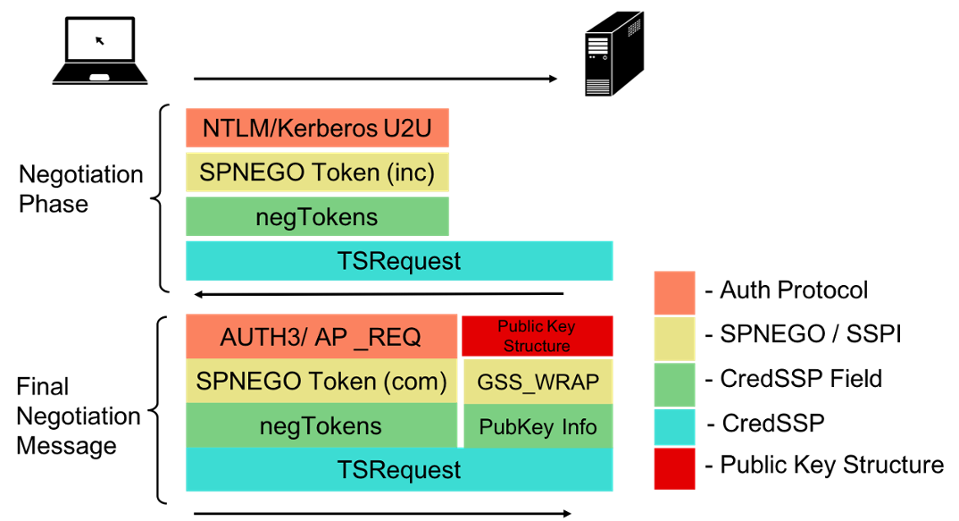
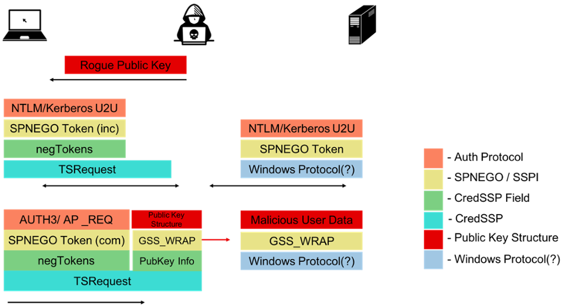
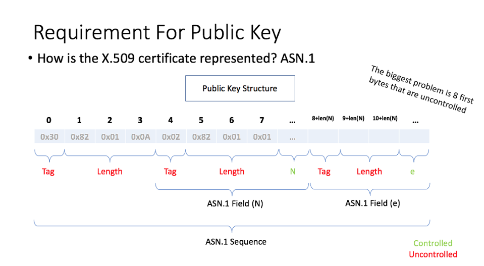
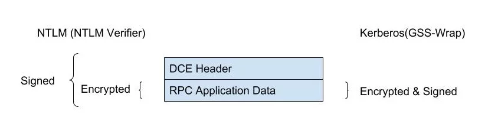
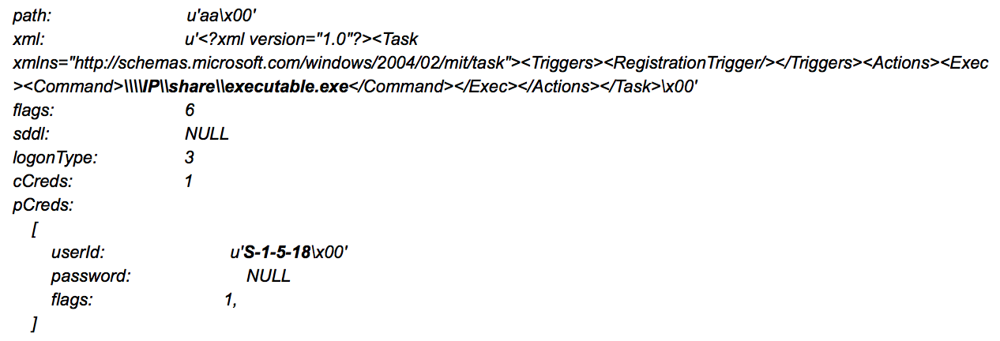
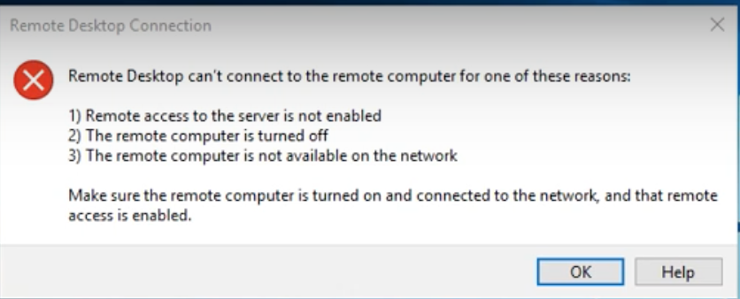

> 译文声明
> 本文是翻译文章，文章原作者 Eyal Karni，文章来源：https://www.preempt.com/ 
> 
> 原文地址：https://blog.preempt.com/how-we-exploited-the-authentication-in-ms-rdp
> 
> 译文仅供参考，具体内容表达以及含义原文为准

在周三的补丁中，微软发布了针对[CVE-2018-0886的补丁](https://portal.msrc.microsoft.com/en-US/security-guidance/advisory/CVE-2018-0886)，这是Preempt发现的一个严重漏洞。此漏洞可分类为逻辑远程代码执行（RCE）漏洞。它类似于经典的中继攻击，但有一个很好的转折：它与RSA密码术（和素数）有关，这使得它非常独特和有趣。

如果您正在查找有关漏洞和管理问题的概述，请参阅Yaron Zinar的[此博客](https://blog.preempt.com/security-advisory-credssp)。 

该漏洞由CredSSP中的一个设计缺陷组成，该漏洞是Microsoft远程桌面和Windows远程管理（包括Powershell会话）中涉及的安全支持提供程序。具有完整中间人（MITM）控制权的攻击者可能会滥用它来代表用户在目标服务器上运行任意代码！

我们已经在域环境中演示了远程桌面协议（RDP）的攻击。如果用户是目标系统上的本地管理员，则利用漏洞使攻击者可以将代码作为SYSTEM运行，从而有效地破坏目标服务器。这适用于Restricted Admin模式和RDP的常规模式。

这里有攻击的视频演示 。 （建议先阅读整个博客）

图1 - CVE-2018-0886利用情景的图示

由于描述的原因，并且由于RDP会话非常普遍，所以这个漏洞对攻击者来说可能非常有价值。 此外，因为它是由设计，该漏洞存在于所有的Windows版本（从Vista） ，只要不适用修复。修复可以在[这里](https://support.microsoft.com/zh-cn/help/4093492/credssp-updates-for-cve-2018-0886-march-13-2018)找到。   

在这个博客中，我们将通过我为促进利用而进行的旅程。一路上，我会解释这个漏洞的技术和数学细节。  

假定读者对Active Directory（AD）环境有一定的了解，主要与Kerberos，NT LAN Manager（NTLM），MS-RDP和安全支持提供程序接口（SSPI）有关。如果您想了解有关这些术语的更多信息，请参阅[白皮书](https://www.preempt.com/wp-content/uploads/White_paper_CredSSP.pdf)中的更多详细信息。

## 旅程：我们如何发现漏洞

### 问题＃1

我们的旅程从我们在Preempt发现的另一个漏洞开始。在该漏洞的情况下，我们展示了即使在不知道目标服务器的私钥的情况下也能够在RDP受限管理模式下执行NTLM中继的能力。这不是微不足道的，因为整个过程在传输层安全性（TLS）下完成，并且因此由服务器的证书加密。您可以了解更多关于此漏洞在[这里](https://blog.preempt.com/new-ldap-rdp-relay-vulnerabilities-in-ntlm)。

由于RDP的实施方式，可能会利用NTLM中继漏洞。我们来看看这个过程：
	
	1.能力谈判（通常选择CredSSP）
	2.TLS成立
	3.网络层认证（NLA）使用CredSSP进行
	4.客户端验证证书，如果需要显示警告
	5.用户接受警告
	6.用户通过CredSSP发送密码（在常规模式下）
	7.登录和远程用户界面活动

建立加密安全会话后，RDP的下一步是NLA。服务器通过常规的身份验证方法（例如Kerberos）验证客户端是否拥有该用户的凭证。这节省了分配登录所需资源的需求。

在第4步中，客户端检查证书。如果证书由受信任的证书颁发机构（CA）签署或证书是手动受信任的，则不会显示警告。但是，如果执行Kerberos身份验证，则Microsoft决定将服务器视为已验证。证书在步骤3中与Kerberos身份相结合。

如果两个条件都不符合，则会显示以下警告：

图2 - 标准MS-RDP警告

您可以在验证证书之前看到NLA发生。因此，第3步可以使用任何伪造的证书。假设一切都安全和正确地完成，这不会是一个问题，但这不是这种情况。我们将这个问题称为＃1。

### 走向问题＃2

在处理问题时，有时需要两个探戈。当我查看CredSSP的规格时，我发现了第二个问题。

CredSSP是用于在MS-RDP中转发用户凭证的基础协议。基本上，[这个协议](https://msdn.microsoft.com/en-us/library/cc226764.aspx?f=255&MSPPError=-2147217396)非常简单：TSRequest消息从客户端传输到服务器，反之亦然。这些消息携带用于认证协议协商阶段的SPNEGO令牌。CredSSP客户端/服务器的协商是透明的。协议通过在步骤1中建立的安全TLS会话进行。

我们来看看图表：

图3 - CredSSP NLA部分

在最终协商消息（accept_complete）中，客户端计算机传输NLTM / Kerberos最终令牌，但它也发送使用SSPI加密和签名的服务器的公钥。公钥结构是从RSA的关键参数派生而来的。现在重要的是，它包含N，e参数，它们是服务器证书的核心。

这是一种称为Channel Binding的技术的常见变体，它旨在通过将TLS会话与Windows身份验证绑定来阻止证书中继攻击。因此，服务器的身份（由证书代表）与标准的Windows身份验证身份（由相关的账户密钥表示）相结合。

尽管如此，这种设计带有固有的致命缺陷。在这个阶段，你可能需要花几分钟时间来发现它。

### 问题＃2

第二个问题是客户端信任服务器的公钥。它实际上加密并签署服务器的字节（公钥结构），而不首先验证其身份。我们可以将这次攻击视为一个选择明文攻击 （CPA）的私人案例。在这种情况下，它对SSPI中的应用程序进行加密和签名（与仅加密的经典攻击相比）。  

这是该漏洞的本质。为了利用它，攻击者会设置一个流氓服务器，并使用公钥作为应用程序数据和有效的RSA密钥。然后它会将加密和签名的应用程序数据转发给真正的预期服务器（当前攻击中不可能有其他服务器）。

图4 - 漏洞利用图

但是真的有可能吗？毕竟，公钥是双重目的。它应该既作为RSA密钥又作为尚未确定的Windows协议的签名应用程序数据有效。这个协议当然应该支持SSPI，但是所有标准的Windows协议都支持它。

让我们首先关注什么是最棘手的问题：我们需要控制RSA公钥（将其转换为应用程序数据）。

## 开发

### 破碎的RSA

（有些熟悉RSA背后的数学知识，更多详细信息，请参阅我们的[白皮书](https://www.preempt.com/wp-content/uploads/White_paper_CredSSP.pdf)。）

我们可以看到，如果我们实现通常的[RSA认证](https://en.wikipedia.org/wiki/RSA_(cryptosystem))，那么我们对N（至少）的控制很少，因为它被选为两个（随机）素数的乘法。出于这个原因，我们选择实施我们自己的“破碎”版本的RSA。

我们选择N = p其中p是素数。

那么我们知道φ(N)= p - 1(你可以看到任何小于p的数字都是p的同素数）。

我们有相同的e 小于N 作为公钥的一部分，e 与φ（N)互质

$$c = m^e\mod N$$

这使我们能够创建一个可以工作的“加密”（虽然它是微不足道的）。

给定一个消息（编码的方式使得它在这个组中）m ，\\(c = m^e\mod N\\)

$$ed + \phi(N)C=1$$

所以，对于“破损”的RSA来说，我们几乎没有什么可以改变的。加密和解密的工作方式与RSA中的相同。我们可以使用原来的O​​penSSL库，但是我们仍然需要删除服务器中的一些优化，因为没有涉及两个素数。

完成此步骤后，我们有一个工作的加密，并控制 N.

但是我们真的有多少控制？我们能否轻松找到素数？  

其实，是！
   
## 寻找素数

根据素数定理：

$$\frac{x}{\ln x}<\pi(x)<1.256\frac{x}{\ln x}$$

其中π

我们有在随机数k 在1 ... N范围内随机落在素数上的机会是：

$$P(\text{k是素数}) = \frac{\pi(N)}{N}$$

$$\frac{1}{\ln N} < P(\text{k是素数}) < 1.256 \ln N$$

其中N是一个数字，是大约600个字节或在其附近\\(2^{600 \cdot 8}\\)（这是一个现实的情景），我们得到一个随机数是一个素数的概率在\\(\frac{1}{3328}\\)和\\(\frac{1}{2651}\\)之间。对适当的范围做精确的计算，得到相似的结果。

2字节的自由度应足以找到合适的素数，因为记录为\\(\log_{256} \ln N \approx 1.46\\)。我们需要尝试约1650个数字才能找到合适的素数（我们可以通过奇数）。在我的电脑上，平均需要70秒才能这样做（并且这是每个环境利用的一次性过程）。

所以，这个问题解决了。但是我们仍然需要找到一个合适的协议。

### 协议要求

最明显的要求是公钥结构将被编码为应用数据。这个结构是ASN.1 。

图5 -  公钥结构

对我们来说意味着数据的前8个字节不在我们的（完整）控制之下.

### NTLM或Kerberos

需要考虑的问题是我们是否可以实施NTLM或Kerberos。SSPI具有基于NTLM和Kerberos身份验证的标准机制。在这两种情况下，如果在协商中同意签署签名，那么包含校验和和序号的头将被添加到应用数据中。另外，SPNEGO协商以启用签名和加密结束，公钥结构中的序列号将为0。

但是，NTLM和Kerberos处理之间有一个重要的区别。它在下面的示意图中显示（对于RPC作为重要示例）：

图6 - GSSAPI中的NTLM vs Kerberos

公钥结构实际上被编码为“无头协议”。整个结构以NTLM格式进行加密和签名，但RPC服务器只希望加密应用程序数据。所以，NTLM为协议增加了另一个限制。这个限制实际上阻止了我们实施对NTLM的攻击，因为我们找不到合适的“无标题”协议。我们不确定这是不可能的。寻找这样的协议可能会产生更强大的利用，允许攻击者选择使用NTLM中继的不同服务器。

另一点要注意的是，在Kerberos中，只要帐户匹配，就不会严格强制检票服务名称。RDP中的帐户是机器帐户。所以，我们可以说Kerberos对Kerberos Relay有轻微的影响。在一个应用程序中使用的数据可以在另一个应用程序中使用，因为它具有类似的CPA。

以下是该协议的要求摘要：

	1.支持SPNEGO
	2.编码要求
		应用程序数据是非ASN.1
		特定的8字节前缀，我们无法控制
		包含一定程度的自由
		如果处理NTLM，则无标题
	3.能够用单个签名的数据包进行伤害
	4.适用于各种机器

一个满足所有要求的协议是MSRPC（除了NTLM工作所需的额外要求外）。我们不知道有任何其他协议符合这些要求。

### 开发

SRPC应用程序数据的编码是MIDL。这是一个非常混乱和非常多样的结构，基本上描述了传递给远程过程的参数。

对于开始的8个不受控制的字节，我们可以选择任何函数，其第一个参数是字符串（可能是指针）。这是因为存在一个称为ReferentId的8字节字段（在64位实现的情况下），其中目标服务器与其值无关。

至于自由字节，无论如何它不会有太大问题，但是RPC忽略了过多的字节， 因此最简单的方法是将它们全部放在最后。

漏洞利用[任务计划程序界面](https://msdn.microsoft.com/en-us/library/cc248263.aspx?f=255&MSPPError=-2147217396)的以下功能（Opnum 1）：

图7 - 导出的功能

任务计划程序界面是管理Windows中计划任务的现代界面。它类似于ATSvc接口（由AT命令触发），但功能更强大，因为它可以更好地控制创建的任务及其属性。

这是在exploit中编码的命令的示例：

该命令创建一个用户标识为SYSTEM的任务。该可执行文件位于攻击者控制的共享中，并立即运行。因此，它可能是任何陈旧的代码。因此，如果用户已经是管理员，则不需要执行特权升级。

### 真实世界的障碍

最后，我们考虑一些现实世界的障碍。在很多情况下，做MITM对于攻击者来说并不难（例如通过ARP中毒），但真正的障碍是Windows防火墙。如果它是ON，那么在普通的现代操作系统上，默认情况下对于任何接口都不启用传入RPC 。

尽管如此，这个漏洞和威胁仍然是非常真实的，并且应用该补丁很重要。由于以下原因：

    1.域控制器在默认情况下仍然容易受到此攻击。这是因为有关RPC的规则存在于域控制器中，以启用任何svchosts.exe DCOM接口。此外，一项快速调查发现，RDP是域管理员倾向于访问DC的最常见方式。换句话说，通过利用这种攻击，攻击者很可能完全控制域名！ 
    2.很多时候，Windows防火墙被关闭或RPC被广泛启用（建议选择性地为您需要的服务启用）
    3.它可以以各种方式被利用，绕过各种环境中的不同可能的防御。不仅使用MSRPC的不同接口，而且还使用不同的协议。（如果你设法，我们想知道）

在开始描述的场景中，几秒钟后，远程桌面会话将失败并显示以下消息：

图8 - 由于漏洞利用导致RDP连接失败后显示的错误消息

并且恶意有效载荷将在特权上下文中在服务器上静静地运行。除此之外，不会有任何警告或可疑迹象。

## 概要

在这篇博客文章中，我们详细介绍了以任务计划程序接口为目标的MS-RDP攻击。在启用了RPC的服务器上，此攻击几乎100％成功。假设攻击者有能力做MITM。  

希望你发现这个漏洞很有趣。显然，强大的基于协议的逻辑漏洞尚未从世界传出。我认为这种弱点在签署任何数据之前尽快强调身份验证的重要性。一般来说，公钥签名带来的问题可能是需要寻找的。
[
你可以在这里看到攻击的视频演示。](https://www.preempt.com/video/exploiting-authentication-in-microsoft-remote-desktop-protocol-ms-rdp-cve-2018-0886/) 
[您可以在这里阅读下载完整的白皮书。](https://www.preempt.com/wp-content/uploads/White_paper_CredSSP.pdf) 

作者希望感谢Preempt研究小组负责人Yaron Zinar一路上的支持和指导，以及写这篇博文的帮助。同时也是市场营销副总裁Heather Howland和产品营销部门的Wade Williamson为本博客提供的所有帮助。

我们将在本月晚些时候出席Black Hat Asia之后发布用于攻击的工具。

希望你喜欢阅读这个博客。

 

